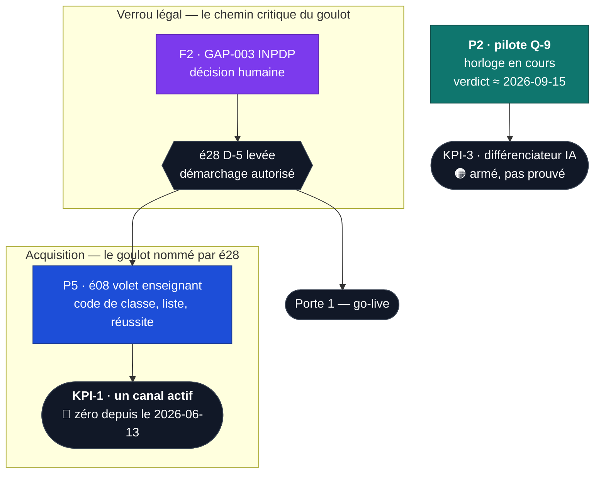

# ROADMAP — ordre d'exécution du reste-à-faire (études & lots)

<!-- roadmap-sync: since-pr=1007 -->

> **Ce fichier ne porte QUE le reste-à-faire du moteur.** Déclinaison opérationnelle de
> l'**étude 26** (profondeur avant largeur). L'état de référence reste
> [STATUS.md](https://github.com/MBeji/yahia-quest-arena/blob/main/STATUS.md) + l'[index des études](./README.md).
>
> ⛔ **Le CONTENU ne se suit plus ici** (décision du 2026-09-07). Il avait sa file — onze lignes de
> prose qui périmaient plus vite qu'on ne les relisait, et dont trois se sont révélées fausses en
> une semaine. Le corpus a mieux : un **outillage qui constate** au lieu d'un texte qui affirme.
>
> | Pour savoir…                                | Lancer                                                  |
> | ------------------------------------------- | ------------------------------------------------------- |
> | ce qui manque, par niveau × matière         | `npm run programme:etat` (fiche × programme × contenu)  |
> | ce qui est mergé mais **pas en production** | l'issue `content-drift`, tenue par la garde du même nom |
> | par quoi commencer, et le dérouler          | `/campagne` — état des lieux vérifié, puis la chaîne    |
>
> Ces trois-là disent la vérité au moment où on les lit ; une ligne de roadmap dit celle du jour
> où quelqu'un l'a écrite. La règle qui suit vaut pour tout ce fichier, et c'est elle qui a fait
> sortir le contenu : **un statut se constate en lançant la commande, jamais en lisant la ligne
> qui en parle.**
>
> ⚠️ **Le jalon « rentrée 2026 » est PASSÉ.** Ce fichier a longtemps compté les jours qui l'en
> séparaient ; il ne s'agit plus de l'atteindre. La vue jalon qui le récapitulait a été retirée le
> 2026-09-07 : elle redisait la scorecard é28 et `STATUS.md`, avec un jour de retard sur eux.
>
> **Élagage du 2026-09-07** : 880 → ~340 lignes. Sont partis le fil CONTENU, l'index « Livré », la
> vue jalon, et toute ligne cochée. Ce qui est livré vit dans `git log`, dans le §8 de son étude et
> dans le journal ci-dessous ; **les leçons de méthode**, elles, sont gardées en annexe (§7) —
> aucune n'a été perdue, c'est la condition qu'a posée l'élagage, comme en 2026-08-24.

---

## 0. Mode d'emploi

1. **Une ligne = une session = un lot = une PR** (règles FableEtudes inchangées : cadre fermé,
   DoD intégral, la session suit sa PR jusqu'au merge réel).
2. **Lire le §1 avant de choisir**, puis prendre la première ligne non cochée de sa file dont
   les dépendances sont satisfaites. L'ordre inter-files est au §2.
3. **« Arbitrage rendu » ≠ « ligne exécutable ».** Vérifier aussi le **statut de l'étude**
   (`brouillon` / `validée` / `en exécution`) et ses questions internes.
4. **Relire l'issue (ou le code) avant de prendre la ligne.** Trente secondes. Deux priorités
   proclamées ici ont été refermées par d'autres pendant que le fichier les disait urgentes
   (§7, leçon L-1).
5. **Un statut se constate en LANÇANT la commande, jamais en lisant la ligne qui en parle.**
   Onze statuts périmés trouvés entre le 2026-09-02 et le 2026-09-07 — dont une étude entière
   donnée « en exécution » alors que ses cinq lots étaient livrés (é07), et un chiffre que la
   session qui venait de le corriger avait laissé faux dans une autre section (§7, leçon L-7).
   C'est cette règle qui a fait sortir le fil CONTENU de ce fichier : il se constate désormais
   avec `programme:etat`, pas avec de la prose.
6. **Le contenu ne se suit plus ici** — voir l'en-tête. Une session de campagne ouvre `/campagne`,
   pas ce fichier.

---

## 1. Le graphe — ce qui bloque quoi

**Ce que le graphe rend visible, et que les files cachaient :**

1. **Le chemin du goulot ne tient plus qu'à UN geste, et il n'est pas codable.**
   GAP-003 (INPDP) → é28 D-5 → é08 enseignant → un canal d'acquisition. Le premier nœud,
   `export_user_data`, est tombé le 2026-09-02 (arena#948) : depuis, **plus rien de codable ne se
   tient entre le projet et le démarchage d'établissement**. Tant que D-5 n'est pas levée, tout le
   reste de la file PRODUIT raffine un produit que personne n'a vu.
2. **L'étage IA est bâti et branché ; ce qui manque est une MESURE, pas du code.** é29 et é11 sont
   en production, les deux clés (famille et plateforme, DeepSeek) tournent en trafic réel depuis le
   2026-09-01. Le pilote Q-9 est une horloge : elle ne s'accélère pas, elle se lit.

## 2. L'ordre — horloges d'abord, puis le chemin du goulot

> Deux natures de travail ne se comparent pas. Une **horloge** coûte du calendrier : on la lance,
> elle tourne seule, et la lancer tard ne se rattrape pas. Un **chantier** coûte de l'effort : il
> attend son tour sans se dégrader. Les horloges passent devant, quelle que soit leur valeur —
> c'est la seule décision que le calendrier prend à notre place.

### ⏱️ Rang 0 — l'horloge en cours

| #       | Ligne                  | Nature                | Où elle en est                                                                                                                            |
| ------- | ---------------------- | --------------------- | ----------------------------------------------------------------------------------------------------------------------------------------- |
| **0.1** | **Pilote Q-9** (§3 P2) | mesure, deux semaines | Partie le **2026-09-01**, neuf jours après le « aujourd'hui » qui l'annonçait. Verdict attendu **≈ 2026-09-15**. Rien à faire que la lire |

### 🎯 Rang 1 — le chemin critique du goulot

| #       | Ligne                       | Pourquoi ce rang                                                                                                                 |
| ------- | --------------------------- | -------------------------------------------------------------------------------------------------------------------------------- |
| **1.1** | **GAP-003 / INPDP** (§4 F2) | Humain, non codable. **Seule moitié manquante de D-5** depuis le 2026-09-02 — le goulot n'attend plus que ce geste administratif |

### 🔨 Rang 2 — ce qui se prend ensuite, par file

| Rang | PRODUIT                                 | FONDATIONS                                          |
| ---- | --------------------------------------- | --------------------------------------------------- |
| 2    | é08 volet enseignant _(⛔ D-5)_ — §3 P5 | **A16** — humain (§4 F5)                            |
| 3    | é20 lots 4 · 8 · 6 — §3 P4              | é25 lot 7 — drill de portabilité (§4 F7)            |
| 4    | —                                       | Le geste opérateur de triage (§4 F10)               |
| 5    | —                                       | Deux majeures bloquées en amont (§4 F9)             |
| 6    | —                                       | Deux gestes de console (§4 F11)                     |
| 7    | —                                       | é24 lot 5 — purge d'historique, **reporté** (§4 F8) |

## 3. FILE PRODUIT — la verticale V1 « apprendre & maîtriser »

> **La file V1 d'origine est close : 20 lignes sur 20.** Les études 04, 07 et 22 sont
> **terminées**, é02 est livrée, é29 est livrée. La boucle d'apprentissage n'a plus de dette
> adaptative. Ce qui suit est **l'étage IA et ce qui vient après V1**.

- [ ] **P2. Le pilote Q-9 — deux semaines de mesure, en cours depuis le 2026-09-01.** ⏱️ **Rang 0.**
      C'est le seul reste-à-faire de é29, et c'est aussi la condition que é11 s'est posée à
      elle-même — jusqu'ici testé contre un transport factice (c'est la règle du §5 de é29 et
      aussi sa limite). **Les deux clés sont maintenant branchées et vérifiées en trafic réel** :
      la clé famille (Réglages `/parametrage`, BYOK) et la clé plateforme (Vercel
      `AI_PLATFORM_API_KEY`/`AI_PLATFORM_PROVIDER`, redéployée) — les deux sur **DeepSeek**,
      confirmées par `/admin/ia` (bloc « clé plateforme »). Le chemin plateforme a buté une fois
      sur le message générique retry-safe (« El Ostedh est en pause » — PAS le message de clé
      invalide, qui nomme le porteur de clé) puis a répondu au deuxième essai — cohérent avec un
      429/5xx transitoire du fournisseur, pas une mauvaise configuration.
      **Verdict attendu vers le 2026-09-15** (deux semaines après le départ réel, pas après le
      2026-08-24 comme espéré alors — la rentrée est passée sans preuve, le risque que ce
      document nommait au 2026-08-24). **Le protocole du pilote est au §5 de é29** ; il n'est pas
      à réinventer ici.
      ⚠️ **Reliquat de P1 (é11 lots 6-7, livrés par arena#844 le 2026-08-24) : l'état de é11 ne
      se lit toujours pas dans son propre document** — ses huit cases de §4 restent vides et son
      §8 dit encore « aucun lot commencé » (vérifié le 2026-09-01). L'inventaire fait foi dans
      `STATUS.md`. **La session qui clôt l'étude (après le verdict du pilote) resynchronise son
      en-tête et déplace son dossier vers `EtudeRealisé/`.**

- [ ] **P4. é20 — réponses acceptées : lots 4, 8 et 6.**
      **Lot 4** — campagne Tier B, une matière par PR, à décider sur la base du pilote (#96,
      `math-1ere/07-reperage-espace`, 25 questions sur 30 couvertes). **Lot 8** — pilote contenu
      `short_answer` : **corpus livré le 2026-09-01, appliqué en prod le jour même** — la doctrine
      R-13/R-14 ouvre le type dans `content-engine`/`content-interactif`/`prof-math-9eme`, et le
      sixième type natif est enfin **joué** : **119 questions libres, une par exercice**, sur les
      119 missions des 20 chapitres de `math` 9ᵉ, zéro dans les `quiz.json`. Reste la **mesure**
      du pilote (signalements, sweep `content-audit`), puis l'accord de Mohamed pour ouvrir le
      type aux autres matières. **Lot 6** (optionnel) — boucle du refus contesté.
      **Dette remontée par le pilote** : Tier A produit « الفوقها » en préfixant « ال » sans
      condition — inoffensif au scoring, mais il consomme la borne des 24 variantes. Candidat à
      un lot moteur.

- [ ] **P3. é34 — étoiles de chapitre & sceaux de matière.** ✅ **Lots 1 à 4 LIVRÉS le
      2026-09-14** — lot 1 en SQL seul (arena#1036 : deux migrations, la doc normative
      `docs/etoiles-et-sceaux.md`, 4 fichiers pgTAP, suite complète à 1 494 assertions et chaîne
      à 217 migrations sans échec), lot 2 à l'écran (arena#1040 : le hub matière LIT le grand
      livre au lieu de recalculer ; arena#1041 en nettoie deux restes — un champ mort sur la
      ligne de chapitre, et un en-tête qui décrivait encore le bandeau remplacé). Étude **validée le 2026-09-14**
      (Q-1…Q-5 arbitrées, dont **Q-2 contre la recommandation** : « maîtrisé » reste l'étoile 4,
      donc la barre parentale ne bouge pas et KPI-E de é31 garde sa série). Approfondissement de
      V1, aucune ouverture. **Lot 1** (SQL seul : `created_at` sur `exercises`/`chapters`, les
      deux tables du grand livre, `mission_is_counted` / `chapter_star_rungs` /
      `chapter_star_live`, le trigger sur `attempts`, le rejeu initial, `student_subject_stars`,
      `get_subject_progress`, `get_attempt_progress`) **est fait** ; **lot 2** aussi (jauge à
      crans présents, bloc sceaux + prochain sceau + effort, ✨, missions de la famille,
      catalogue i18n paresseux `progress/`, `chapter-completion.ts` supprimé) ; **lot 3** aussi
      (arena#1042 SQL puis arena#1043 écrans : `admin_engagement_overview` sur le grand livre +
      distribution, médiane, sceaux par actif et **étoiles préservées** ; carte `/parcours` où
      `done` devient le sceau ⭐⭐⭐⭐ ; QG où le sceau remplace la moyenne des scores ; suivi
      parental à barre empilée et lacunes triées par prochaine étoile ; note de continuité
      KPI-E dans STATUS §1bis) ; **lot 4** aussi (arena#1044 SQL puis arena#1045 écrans : trois
      méta-badges de maîtrise — `first_seal`, `subject_elite`, `parcours_covered` — décernés par le
      trigger et **sans aucune XP ni pièce** ; le bloc étoile du résultat, qui n'apparaît que si le
      SERVEUR dit que l'étoile monte ; la modale de sceau, une seule par résultat, qui respecte
      `prefers-reduced-motion` et n'enchaîne rien ; la collection de sceaux datés au QG ; la ligne
      « Ta semaine » et deux événements produit sans PII). Reste **lot 5** (optionnel, GAP-037)
      suspendu à la liste des 50 savants, qui est du contenu.
      ⚠️ Ce que le lot 1 ne fait PAS : aucune UI, aucun badge, et **aucune touche à
      `submit_exercise_attempt`** (D-4 : un trigger sur `attempts` + une lecture, jamais une
      greffe de plus dans les 570 lignes que trois études ont déjà ré-émises).
      ⚠️ Ce que le lot 2 ne fait PAS : ni carte, ni QG, ni parent, ni admin (lot 3) ; aucune
      célébration (lot 4) ; `get_best_scores_by_exercise` **reste en base** — sa dépose serait
      une migration destructive, donc un merge séparé (DoD §7), et ses autres lecteurs restent
      à inventorier.
      ⚠️ Ce que le lot 3 laissait à surveiller — le chunk `dashboard` à **35,07 / 36 KB**, « le
      prochain lot qui touche au QG découpe avant d'ajouter » — est **tenu sans découper** : le
      lot 4 le laisse à **35,08 / 36 KB**, sa vitrine de sceaux tombant dans
      `dashboard-badges-shop`, qui est déjà son propre chunk. La consigne reste valable pour le
      lot suivant.
      ⚠️ Ce que le lot 4 ne fait PAS : trois badges et pas un de plus (D-7 — 94 matières × 4
      sceaux ne rentrent ni dans `Record<BadgeCode, …>` ni dans le budget `i18n-badges`), aucune
      XP ni pièce (R-11, le registre é09 garde la main), une seule modale par résultat, et elle
      n'enchaîne rien (é31 R-6).

- [ ] **P5. é08 — volet enseignant.** ⛔ **Précondition dure é28 D-5** : GAP-024 **et** GAP-003.
      Sortie de la file différée V4 le 2026-08-13 (é28 Q-3) : code de classe, liste d'élèves,
      taux de réussite par chapitre. Motif — c'est le **seul canal à CAC ≈ 0** au budget réel
      (1 000-2 000 TND/an), donc le chemin le plus court vers KPI-1.
      ✅ **Re-scopage FAIT le 2026-08-24.** Le §0 de l'étude trie les huit US de 2026-07-04
      ligne à ligne — **six sont livrées ou périmées** — et renvoie l'écran livré à
      `docs/suivi-parental-quotidien.md`, qui en est désormais la spec normative ; le wording
      « premium » est supprimé. **Ce qui reste de P5** = les lots 4·5·6 de l'étude (classes +
      code + adhésion, puis liste + taux par chapitre, puis le devoir). La portée exacte de
      D-5 — prospection seule, ou aussi construction ? — est posée en **Q-4**, à trancher
      avant le lot 4.
      💡 **Trois lots parent en sont sortis, sans précondition et exécutables tout de suite** :
      l'examen blanc au rapport (é02 est livrée, `get_mock_exam_percentile` existe et rien ne
      le montre au parent), le digest hebdo enrichi opt-in (le push dominical est toujours le
      générique), et le comparatif de parcours seuillé (jamais construit).

- [ ] **P6. é35 — comprendre la théorie : le patron de notion en sept temps, pilote maths 9ᵉ.**
      ✅ **Validée et lots 1-2 LIVRÉS le 2026-09-16** (Q-1…Q-6 arbitrées, toutes sur la
      recommandation). **Lot 1** au moteur (arena#1050) : le bloc `verifie` — le couple « exemple
      résolu → à toi de jouer » a enfin une syntaxe, sa réponse repliée dans un `
`
      **natif** dont `open` est délibérément hors de l'allowlist —, six contrôles structurels
      (C-1…C-6) à **deux régimes** (`warn` tant qu'une matière n'a pas déclaré `coursePattern`,
      `error` après), et les deux champs de schéma lus par le gate seulement. Mesuré sur les
      **999 chapitres : 0 erreur, 332 avertissements**, dont 3 en maths 9ᵉ. **Lot 2** au corpus
      (privé#403) : `course-explanation.md` — référence normative de l'axe 2 comme
      `course-figures.md` l'est de l'axe 5 —, six documents amendés, et la maquette
      `06-fonctions-lineaires-affines` réécrite aux sept temps (138 → 273 lignes, 6 tags déclarés,
      **37 calculs re-dérivés**, zéro constat sous patron quand les 19 autres en produisent 38).
      **Lots 3, 4 et 5 LIVRÉS** : 13 des 20 chapitres
      de maths 9ᵉ sont au patron — tranche numérique (`01`, `02`, `15`, `16`, `17`, privé#406),
      algébrique (`19`, `03`, `04`, `05`, privé#407) et géométrie A (`08`, `09`, `10`, `11`).
      **390 calculs re-dérivés indépendamment** sur les trois lots, zéro faux ; les 29 figures
      é18 conservées **octet pour octet** ; 76 `coursePitfalls` déclarés, tous tirés des tags
      que portent les distracteurs de leur propre chapitre.
      ⚠️ **Le lot 5 a surtout corrigé deux MESURES fausses**, et c'est son vrai apport :
      **R-13** a perdu son plafond par cours (8 des 10 chapitres au patron l'enfreignaient, la
      maquette comprise) au profit d'un déclencheur au NOMBRE de notions ; et **C-6** comptait
      les lignes vides et le corps des `<svg>` — les sept sections qu'il dénonçait en maths
      étaient sous le seuil, dont une signalée à 72 lignes qui en porte **19**. Corpus entier :
      **336 → 262 avertissements, 74 faux supprimés**, à seuil inchangé.
      ⚠️ **Un arbitrage attend, et il porte sur la règle, pas sur les cours** : **8 des 10**
      chapitres au patron passent le plafond de 240 lignes de R-13 — `03` (390), `15` (379),
      `04` (351), `17` (302), `05` (281), **`06` (273, la maquette de référence)**, `01` (254),
      `16` (252). Aucun n'a été tronqué. Mais **par notion** le patron tient : 5 des 10 sont
      dans la fourchette 18-40 l/notion de R-13, médiane 43. Les longs le sont parce qu'ils
      portent PLUS DE NOTIONS (`03` : 10 notions × 39 lignes), pas parce que leurs notions
      enflent. R-13 se contredit : son titre dit « budget par notion », sa dernière phrase pose
      un plafond par cours — 240 n'était que l'arithmétique d'un cours à six notions.
      ⚠️ **Et un constat de programme** : `05-systemes` est **hors programme 9ᵉ** — le registre
      de transcription l'établit sur les 221 pages du manuel.
      **Reste** : les lots 5-6 (deux tranches, `coursePattern` posé au dernier), le lot 7
      (mesure, au premier trafic) et le lot 8 (bilan, qui tranche Q-5).
      Le topo public suit (arena#1049 à l'écriture, **arena#1051** au passage en exécution) : le
      gate `etudes-index` compare l'en-tête de l'étude au §4 de `STATUS.md`, et les deux dépôts
      se contredisent tant que les deux PR ne sont pas mergées — c'est arrivé sur privé#403, dont
      le rouge n'était le défaut d'aucun de ses fichiers.
      Le constat qui la fonde, mesuré sur `main` avant d'écrire : l'appareil de blocs de é18 est **presque inutilisé pour le
      savoir** — sur les 20 cours de maths 9ᵉ, 54 `::: figure`, 1 `::: methode`, zéro
      `definition`/`exemple`/`propriete` —, la règle « concret avant abstrait » de la barre n'a ni
      patron, ni gate, ni mesure, et les cours commencent à l'encadré du manuel en sautant son
      activité (« نشاط ») et son exercice corrigé. **Lots** : 1 moteur (`verifie` + C-1…C-6 +
      `coursePattern`/`coursePitfalls`) · 2 doctrine (`course-explanation.md`, skills, maquette
      `06-fonctions-lineaires-affines`) · 3-6 la campagne, quatre tranches de ≤ 5 chapitres,
      `coursePattern` posé au dernier · 7 mesure (`admin_lesson_to_quiz_outcome`, console —
      Q-6 : au premier trafic) · 8 bilan et Q-5 (matière suivante). Approfondissement de V1
      (lecteur de cours, M2 → M3), aucune ouverture ; informe é23 lot 5 (même matière, fichiers
      disjoints). L'état de l'art (annexe A) porte une **réserve** : sources vérifiées au niveau
      du résumé (proxy de session), une méta-analyse rétractée écartée.

---

## 4. FILE FONDATIONS (parallèle — ne bloque pas la file produit)

- [ ] **F2. GAP-003 — conformité mineurs / INPDP.** 🎯 **Rang 1, et depuis le 2026-09-02 le
      SEUL.** Décisions juridiques, non codables, **non vérifiables depuis un dépôt**. F1 étant
      livrée, c'est le dernier prérequis légal du lancement, quel que soit le modèle gratuit —
      plus rien de codable ne se tient entre le projet et le démarchage.
      Restent dans le même dossier : l'identité d'éditeur pour des mentions légales complètes,
      et la décision « français seul ou trilingue » — traduire un engagement juridique sans
      relecture lui ferait dire autre chose.

- [ ] **F5. A16 — recaler le garde-fou du rachat de série.** ✅ **A15 est FAIT**, constaté en
      exécutant `economy:check` le 2026-09-03 : G-1 affiche la fenêtre par profil que l'arbitrage
      du 2026-08-24 demandait — assidu **J+6** (fenêtre 5-14) ✓, moyen **J+31** (14-35) ✓,
      occasionnel **non jugé** ✓. Cette ligne le donnait encore ouvert, avec l'avertissement
      « tant que G-1 reste au tableau, `economy:check` échoue par construction ». Il n'échoue
      plus par construction : **il échoue sur G-4**, et c'est autre chose.
      **Reste donc A16**, et il est **humain** : le simulateur mesure que le rachat de série
      couvrirait **53 %** des jours manqués (pas 38 % comme ce fichier l'a longtemps écrit) —
      la série s'achète, donc elle ne mesure plus l'assiduité. Le prix est un arbitrage, pas un
      lot. ⚠️ Et le garde-fou qui en débat a lui-même été corrigé depuis (arena#947 : « le rachat
      de série n'avait aucune porte atteignable — et le garde-fou qui en débat mesurait autre
      chose »), donc rouvrir A16 sur les anciens chiffres serait rouvrir sur du faux.

- [ ] **F7. é25 lot 7 — drill de portabilité.** Dernier lot de l'étude harness (les six autres
      sont livrés). **À faire avec Mohamed**, session hors file. C'est ce qui la fermerait.

- [ ] **F8. é24 lot 5 — purge de l'historique git public.** Volontairement **reporté à une
      fenêtre calme constatée**. Conséquence assumée : le KPI §1 de é24 n'est atteint qu'au
      **tip**, pas dans l'historique, où le corpus de mai→juillet 2026 reste lisible — couvert
      explicitement par `LICENSE-CONTENT.md`. **Lot 6 partiel** : catalogue TEST restauré, reste
      la tier e2e authentifiée. **Q-4** (OTDAV/INNORPI) ouverte, démarche humaine.

- [ ] **F9. Deux majeures, bloquées en amont.** **arena#660** — `typescript` v7.0.2, gate rouge,
      `typescript-eslint` incompatible : attendre l'amont, ne pas forcer. **arena#595** — aligner
      `@types/node` (v26) sur le runtime CI, **passé à Node 24** (arena#688), pas 26.
      ⚠️ #660 remplace #593, close.

- [ ] **F10. Le geste opérateur de triage** (arena#673). Plus aucun blocage technique :
      `report-triage.yml` tourne 6×/jour et va jusqu'à la PR, et sa panne de 25 jours est
      corrigée (arena#824 — l'URL prod vient du dépôt, plus d'un secret ; un run rouge ouvre une
      issue de suivi). Reste à appliquer depuis `/admin/content-reports` et `/admin/bug-reports`
      les `dismissed` recommandés.
      ⚠️ **Ne pas fermer #673 sans traiter la file** : ses UUID canoniques tiennent les
      signalements hors du chemin « fresh reports » du pré-gate.

- [ ] **F11. Deux gestes de console qui restent dus.**
      (1) **Coller les 3 gabarits d'e-mail FR** dans Supabase — aujourd'hui le premier contact du
      produit avec un parent part **en anglais**.
      (2) Vérifier qu'un événement `web_vitals` **arrive réellement** dans PostHog — sans clé le
      beacon n'émet rien, et un tableau de bord vide se lit à tort « aucun problème ».

---

## 5. Arbitrages en attente

> Les arbitrages **A1→A14** sont rendus et leurs conséquences sont dans les études concernées ;
> ils ne sont plus recopiés ici. **Ne restent que ceux qui attendent une décision.**

| #       | Constat mesuré                                                                                                                                                                                                                              | Ce qui est à trancher                                                                                                                                                        | Depuis     |
| ------- | ------------------------------------------------------------------------------------------------------------------------------------------------------------------------------------------------------------------------------------------- | ---------------------------------------------------------------------------------------------------------------------------------------------------------------------------- | ---------- |
| **A15** | **G-1 (« niveau 5 en 7-14 j ») échoue des DEUX côtés** : l'assidu l'atteint au jour 6, le moyen au jour 31. À 3 j/semaine × 2 exercices, 800 XP demandent ~5 semaines — le seuil est arithmétiquement hors d'atteinte pour le persona moyen | **Recaler G-1** : une fenêtre par persona, ou une cible qui décrive le moyen. ⚠️ **Ne PAS retoucher `gamification.ts` pour faire passer le test** — ce serait régler l'outil | 2026-08-03 |
| **A16** | **G-4 (shields ≤ 20 % des jours manqués) échoue à 38 %.** Celui-là est un **signal d'économie**, pas un seuil trop serré : à 15 coins, le rachat de série est bon marché face au revenu                                                     | Desserrer le seuil **ou** renchérir le shield. La revue est **mensuelle** (A9) — rien n'oblige à trancher ce jour                                                            | 2026-08-03 |

**Ce qui reste à la main de Mohamed, hors lots** : é23 Q-3 (self-désigner l'app child-directed
auprès de Google — le paragraphe « vidéos YouTube » a désormais une page où vivre, arena#701) ·
é24 Q-4 (démarche OTDAV/INNORPI) · **F2** (GAP-003/INPDP — F1 est livrée) · le geste opérateur de triage
(**F10**) · les gabarits d'e-mail FR (**F11**) · le drill de portabilité de é25 (**F7**).
✅ **Brancher une clé pour le pilote Q-9 est fait** — les deux clés (famille et plateforme,
2026-09-01) ; reste seulement à attendre son verdict (§3 P2).

---

## 6. Différées & gelées (ne rien lancer avant leur porte)

| File                                  | Porte d'entrée                                 | Contenu                                                                                                                                                                   |
| ------------------------------------- | ---------------------------------------------- | ------------------------------------------------------------------------------------------------------------------------------------------------------------------------- |
| **Gels doctrine** (A1-Q3, 2026-07-20) | Dégel par décision humaine explicite           | é06 (PWA offline) · é10 (anti-fraude — se dégèle au **volume réel** de V3) · é12 (studio d'ingestion in-app)                                                              |
| **Gel de phase**                      | Sortie de la phase gratuite (décision humaine) | é01 (paiement en ligne — véhicule de réactivation du premium)                                                                                                             |
| **Brouillon non ouvert**              | Q-1…Q-5 à arbitrer                             | é27 (sources web tierces) — sert le trou physique-chimie lycée ; **ne dégèle pas é12** ; son lot 2 (garde anti-verbatim) est **déjà livré** dans `content:qa` (arena#722) |

---

## 7. Annexe — les leçons de méthode

> Ces leçons ont été payées par des pannes réelles, chiffrées. Elles vivaient dans des
> lignes cochées que l'élagage du 2026-08-24 a supprimées ; **c'est ici qu'elles survivent**.
> Une roadmap qui perd ses leçons en gagnant en lisibilité a fait un mauvais échange.

**L-1 — Une priorité écrite le jour J et mergée à J+6 n'est pas une priorité, c'est un
instantané périmé.** Le 2026-08-10, deux lignes étaient déclarées « PREMIÈRE LIGNE DE TOUTE LA
ROADMAP » et « deuxième priorité » : **C11** et **F10**. Les deux ont été refermées par d'autres
sessions **avant** que le fichier qui les proclamait urgentes n'atteigne `main`. Remède, et il
coûte trente secondes : **relire l'issue — ou le code — avant de prendre la ligne.**

**L-2 — Une garde qui échoue en silence est indistinguable d'une garde qui passe ; une garde qui
certifie faussement est pire que pas de garde.** Quatre cas, aucun théorique. (1) Le garde
pédagogique n'avait **jamais** tourné — token OAuth invalide (2026-07-25). (2) Il retombe en
panne le 2026-07-29, **douze jours**, pendant lesquels **la plus grosse campagne de contenu du
projet** (`english-3eme-sec`, `english-bac`, `french-bac` — 17 sujets) a été écrite **sans filet
pédagogique** ; les correctifs #138, #140, #146, #147, #148 montrent que les erreurs de fond
existaient bien, trouvées par des audits **décidés à la main**. Ce qu'aucune session n'a décidé
de relire n'a été relu par personne. (3) `video-health.yml` a échoué **trois fois au même
endroit** avec les mêmes 357 lignes de log, sa sonde disant « 0 vidéo cassée » — et l'étape qui
**ouvre** l'issue portait le même défaut, donc elle aurait échoué **le jour même où ce garde
sert**. (4) La sonde des manuels ne tournait pas du tout sous Windows et **a REFERMÉ son issue
en affirmant que tout allait bien**. **Ce qui manque n'est jamais la garde : c'est que sa panne
atteigne quelqu'un.** C'est ce qu'arena#831 (la garde des gardes) répare — et sa première issue,
arena#833, est au rang 1.

**L-3 — Une fonction SQL vivante se SUBSTITUE, elle ne se retape pas.** En livrant é04 A2
(arena#818), `get_daily_plan` retapée à la main sortait un algorithme **entièrement réinventé** :
score normalisé perdu, `DISTINCT ON` anti-doublon perdu, exclusion des quiz du repli perdue.
C'est le `diff` contre sa révision vivante qui l'a montré — **pas un test**. La version livrée
est une substitution par script sur le texte extrait, et `35_daily_plan.test.sql`, **inchangée et
restée verte**, en est la preuve.

**L-4 — Un seuil pédagogique dupliqué n'est plus ajustable, il est juste faux à plusieurs
endroits.** L'étude 04 promettait en R-2 des constantes « centralisées » ; le triplet
(3 occurrences, 2 séances, 30 jours) était écrit à la main dans `get_daily_plan` **et** dans
`get_tutor_learner_context`. Deux lignes de plus en auraient fait quatre copies.
`misconception_active_thresholds()` porte désormais les trois nombres et
`active_misconceptions()` la définition, **les deux appelants rebranchés dans la même migration**.
Corollaire vérifié deux fois : **ne jamais recopier une RPC existante** — recopier crée un second
juge sur la même question.

**L-5 — La prod n'est pas le juge de la reconstructibilité, et un gate vert ne veut pas dire
« à jour ».** Une migration peut passer en prod (où ses parents existent de longue date) et
rendre impossible la construction d'une base vierge : quatre pannes en cascade après é24 lot 4,
invisibles pour les checks requis. Symétriquement, `check-roadmap-sync` était **vert** pendant
que 37 PR livrées n'étaient citées nulle part — il ne lit que les sujets de commit du **moteur**
en forme « étude/lot », et sept jours s'étaient joués **au privé**. Un gate vert veut dire
« rien de ce que je sais lire ne manque », jamais « tout va bien ».

---

**L-6 — Le contenu commande le produit, pas l'inverse.** Mesuré en août 2026 : **dix-huit jours de
file PRODUIT à l'arrêt**, levés en deux jours par une PR de **corpus** (privé#219). L'ordre des
files le cachait — chacune disait dans quel ordre prendre SES lignes, aucune ne disait ce qu'elle
attendait de l'autre. La leçon survit à la sortie du fil CONTENU de ce fichier (2026-09-07) et
c'est même pour ça qu'elle est écrite ici : **une dépendance qui n'a plus de ligne doit avoir une
leçon**, sinon elle redevient un angle mort. Avant de conclure qu'une file PRODUIT est bloquée par
du code, lancer `programme:etat`.

**L-7 — Un fait chiffré vit à plusieurs endroits d'un même document ; le corriger à un seul
FABRIQUE la divergence.** Le 2026-09-06, une campagne soldée a été mise à jour dans sa file et dans
le graphe, **pas dans la table du rang 0** — celle qu'une session lit en premier. Elle y annonçait
encore un travail fait. Onzième statut périmé de la série, et le premier fabriqué par la session
qui venait de corriger les dix autres. Le geste qui l'évite tient en une commande : après avoir
changé un chiffre, `grep` ce chiffre dans le fichier **avant** de committer. Rien ne garde cela —
`roadmap-sync` vérifie qu'une PR est **citée**, jamais qu'un nombre est cohérent d'une section à
l'autre (arena#994).

## 8. Journal de la roadmap

> ⚠️ Les entrées antérieures au 2026-09-07 citent les numéros de section de la structure
> d'alors (un §5 CONTENU, un §9 « Livré », une vue jalon au §8). Elles ne sont pas réécrites :
> un journal daté se lit tel qu'il a été écrit, sinon il ne prouve plus rien.

| Date           | Événement                                                                                                                                                                                                                                                                                                                                                                                                                                                                                                                                                                                                                                                                                                                                                                                                                                                                                                                                                                                                                                                                                                                                                                                                                                                                                                                                                                                                                                                                                                                                                                                                                                                                                                                                                                                                                                                                                                                                                                                                                                                                                                                                                                                                                                                                                                                                      |
| -------------- | ---------------------------------------------------------------------------------------------------------------------------------------------------------------------------------------------------------------------------------------------------------------------------------------------------------------------------------------------------------------------------------------------------------------------------------------------------------------------------------------------------------------------------------------------------------------------------------------------------------------------------------------------------------------------------------------------------------------------------------------------------------------------------------------------------------------------------------------------------------------------------------------------------------------------------------------------------------------------------------------------------------------------------------------------------------------------------------------------------------------------------------------------------------------------------------------------------------------------------------------------------------------------------------------------------------------------------------------------------------------------------------------------------------------------------------------------------------------------------------------------------------------------------------------------------------------------------------------------------------------------------------------------------------------------------------------------------------------------------------------------------------------------------------------------------------------------------------------------------------------------------------------------------------------------------------------------------------------------------------------------------------------------------------------------------------------------------------------------------------------------------------------------------------------------------------------------------------------------------------------------------------------------------------------------------------------------------------------------- | -------------------------------------------------------------------------------------------------------------------------------------------------------------------------------------------------------------------------------------------------------------------------------------------------------------------------------------------------------------------------------------------------------------------------------------------------------------------------------------------------------------------------------------------------------------------------------------------------------------------------------------------------------------------------------------------------------------------------------------------------------------------------------------------------- |
| **2026-09-16** | **é35 validée, lots 1 et 2 livrés — le cours cesse d'énoncer.** Les six arbitrages rendus le jour même, tous sur la recommandation. **Lot 1** (arena#1050) : `::: verifie`, neuvième type du vocabulaire et le seul dont le corps a deux côtés, sa réponse repliée dans un `
` NATIF — zéro script, et `open` délibérément hors de `ALLOWED_ATTR`, donc le contenu ne peut pas décider qu'une réponse arrive révélée ; six contrôles de forme (C-1…C-6) qui comptent des blocs et des lignes et ne reniflent jamais la prose ; deux régimes qui rendent l'adoption possible matière par matière. **0 erreur sur les 999 chapitres**, 332 avertissements qui SONT le backlog de la campagne. Les 8 tests XSS de é18 passent sans avoir été touchés. **Lot 2** (privé#403) : la doctrine `course-explanation.md`, six documents amendés dont l'axe 2 de la barre et les skills d'écriture et d'audit, et la maquette `06-fonctions` — dont l'ancrage réel, le taxi, vivait ligne 121 sur 138 et ouvre désormais sa notion. **Deux choses trouvées en exécutant** : le résumé n'a aucune grammaire de blocs, donc R-21 était tenue par construction ; et il fallait un septième contrôle, non prévu, pour qu'une matière ne puisse pas déclarer le patron sans l'employer — tous les autres se déclenchent en PRÉSENCE d'un bloc, donc un cours qui n'en pose aucun les traversait tous en silence.                                                                                                                                                                                                                                                                                                                                                                                                                                                                                                                                                                                                                                                                                                                                                                                                                                                                                                                                       |
| **2026-09-16** | **é35 écrite — comprendre la théorie : le patron de notion en sept temps, pilote maths 9ᵉ** (privé). Mesuré sur `main` avant d'écrire : les 20 cours de maths 9ᵉ portent 54 `::: figure`, 1 `::: methode` et **zéro** bloc `definition`/`exemple`/`propriete` — l'appareil de é18 sert aux figures, pas au savoir ; `06-fonctions` ouvre sur la définition formelle et range son seul ancrage concret (le taxi) ligne 121 sur 138 ; la transcription du manuel (11 530 lignes) montre la séquence officielle نشاط → encadré → أطبق → تمرين مرفق بحل, que les cours sautent ; le renderer n'a aucune syntaxe pour un contrôle sur place ; rien ne joint `learning_pulses` à `attempts`. L'étude pose un patron en sept temps (ancrer, nommer, voir, résoudre, distinguer, généraliser, vérifier), 22 règles, une grille d'audit, six contrôles `content:qa`, un lot moteur (bloc `verifie` en `
`), une doctrine + maquette, quatre tranches de campagne, une mesure armée (Q-6). **Réserve consignée** : les quatre recherches documentaires ont été vérifiées au niveau du résumé (proxy de session), et Wang & Fan 2025 (rétractée) est écartée. Q-1…Q-6 ouvertes ; ligne P6 au §3, ligne « brouillon écrit » au §6.                                                                                                                                                                                                                                                                                                                                                                                                                                                                                                                                                                                                                                                                                                                                                                                                                                                                                                                                                                                                                                                                                                                 |
| **2026-09-14** | **é34 lot 4 livré au moteur — ce qu'un élève vient de gagner se voit, et se collectionne** (arena#1044 SQL, arena#1045 écrans, deux merges pour que l'additif précède le code — DoD §7). **Trois badges, et pas un de plus** (D-7) : `first_seal`, `subject_elite` (sceau ⭐⭐⭐⭐) et `parcours_covered`, décernés par le trigger lui-même et **sans aucune XP ni pièce** — le pgTAP le vérifie littéralement (`(xp, yahia_coins) = (0, 0)`), l'étude 09 garde seule la main sur la valeur. 94 matières × 4 sceaux ne rentrant ni dans `Record<BadgeCode, …>` ni dans le budget `i18n-badges`, les sceaux gardent une **vitrine à part**, datée. **Côté écran** : le bloc étoile du résultat n'apparaît que si le SERVEUR dit que l'étoile monte (`starAfter > starBefore`) — une fête à chaque exercice n'est plus une fête ; la modale de sceau est **unique par résultat**, passe derrière le level-up, respecte `prefers-reduced-motion` (ce que son aînée ne fait pas) et **n'enchaîne rien** (é31 R-6). **Quatre défauts trouvés en exécutant** : (a) `RETURNING … INTO` sur l'insertion des sceaux **lève** — elle pose 1..r lignes d'un coup et un `INTO` de plpgsql en exige exactement une ; le trigger tournant sur chaque insertion dans `attempts`, la faute a fait tomber la suite pgTAP **entière** ; (b) une **boucle de rendu** — `resetRun` a pris l'objet du nouveau hook en dépendance, donc la page de quête prenait 100 % d'un cœur sans jamais rendre — et elle ne s'est vue que comme « 2 errors » à côté de 339 fichiers verts, un `                                                                                                                                                                                                                                                                                                                                                                                                                                                                                                                                                                                                                                                                                                                                                                                 | tail`rendant **0** sur cette suite rouge (le code de sortie d'un pipeline est celui de`tail`) ; (c) le **report de la modale** survivait au geste qui l'avait demandé, donc un élève qui enchaînait voyait le sceau de l'exercice précédent se lever sur le nouveau ; (d) le **grand livre n'était nettoyé par aucun run e2e** — insert-only et monotone, il ne casse rien le premier soir et casse tout les suivants, sur un code sain. **Preuves** : 4 345 tests, pgTAP 107 fichiers / 1 529 assertions, `build:check`et`smoke:shell`verts. ✅ L'avertissement du lot 3 sur le chunk`dashboard`est **tenu sans découper** : 35,08 / 36 KB, la vitrine des sceaux tombant dans`dashboard-badges-shop`, déjà son propre chunk. Reste le lot 5, optionnel, suspendu à une liste qui est du contenu. |
| **2026-09-14** | **é34 lot 3 livré au moteur — le pourcentage quitte trois écrans, et la console cesse de recalculer** (arena#1042 SQL, arena#1043 écrans, deux merges pour que l'additif précède le code — DoD §7). **Côté mesure** : `chapters_completed` de KPI-E **garde sa définition** (Q-2 a maintenu la barre à l'étoile 4) et **change de source** — il se lit au grand livre, donc il ne peut plus baisser quand une campagne publie du contenu ; avant, ajouter une mission retirait le chapitre du compte de tous ceux qui l'avaient fini, et **rien ne permettait de le voir dans la série**. La console gagne la **distribution des étoiles** et sa **médiane** (le chiffre de contrôle de Q-2), les **sceaux par actif**, et les **étoiles préservées** — la promesse de l'étude en un chiffre. **Côté écrans** : la carte `/parcours` marque `done` sur le **sceau ⭐⭐⭐⭐** et affiche « ⭐⭐ · 14/20 » ; le QG remplace son « 82 % » — qui était la **moyenne des scores**, servie dans la même forme que le « 40 % » de couverture de la carte, deux écrans voisins et deux sens différents ; le suivi parental met une **barre empilée 0→4 au-dessus** du compte, qui nomme enfin son verdict (« 7 maîtrisés sur 24 » — le 2026-09-04, « 7/24 chap. » s'était lu « il a fait 7 chapitres sur 24 »), plus une ligne ✨ pour ce qui est arrivé depuis. **Deux défauts trouvés en exécutant** : le client **défaisait le tri du serveur** sur les lacunes (il re-triait sur le total des missions restantes au lieu de `missing_for_next`, enterrant le chapitre à un geste sous celui qui en demandait quatre) et **jetait au parse** les deux colonnes ajoutées au lot 1 ; et `admin_engagement_overview` était **le dernier lecteur à écrire `score_pct >= 60` à la main**, sans l'anti-précipitation. **Preuves** : 4 318 tests, pgTAP 106 fichiers / 1 511 assertions, 218 migrations, `build:check` et `smoke:shell` verts. ⚠️ Le chunk `dashboard` est à **35,07 / 36 KB** : le prochain lot qui touche au QG découpe avant d'ajouter. Reste le lot 4 (célébrations, 3 badges) et le lot 5, optionnel, suspendu à une liste qui est du contenu.                                                                                                                                                                                        |
| **2026-09-14** | **é34 lot 2 livré au moteur — le hub matière cesse de recalculer, il lit** (arena#1040). Le hub tenait sa propre copie des seuils de complétion, et elle produisait deux défauts : un chapitre fini qui recevait une mission repassait de « Chapitre terminé ✓ » à « 3/4 » sans explication, et la copie avait **divergé** — elle ignorait l'anti-précipitation, donc une réussite expédiée à 65 % cochait la mission à l'écran sans rien donner au grand livre. `getSubject` appelle désormais `get_subject_progress` (à aller-retour constant, en remplacement de `get_best_scores_by_exercise` **pour cet écran seulement**), et l'écran montre trois choses qui ne peuvent pas se contredire parce qu'elles ne répondent pas à la même question : la **jauge** dit l'acquis (grand livre, jamais décroissant), le **compteur de cran** dit le reste-à-faire (vivant), **✨** nomme l'écart. Livré avec : `progress-stars.ts` (lecture défensive + dérivations, aucune décision), `star-gauge`/`seal-mark` (primitives, libellés en props), `chapter-stars`/`subject-seals`, le bloc « état de la matière » (sceaux, « 12/20 chapitres prêts, dont 1 nouveaux », effort en **compteurs** et jamais un pourcentage), le catalogue i18n **paresseux** `progress/` (chunk `i18n-progress` à 3,67 KB pour 16 KB de budget — `i18n-` n'a pas bougé), et `next-action` passé au vocabulaire du grand livre (mêmes six priorités, mêmes cas, mais « Reprendre ici » désigne enfin la même mission que la jauge). `chapter-completion.ts` et son test sont **supprimés** ; `chapterComplete` et `todo` quittent le catalogue app-wide, devenus morts. **Preuves** : 4 297 tests (+34) — jauge (crans variables, RTL sans inversion, ✨, vacuité), sceaux, anonyme, i18n trois langues (complétude, substitutions, chiffres occidentaux, mots interdits par R-1), contrat de `getSubject` ; e2e connecté (une mission réussie allume un cran) et public (la forme sans calcul, sans verrou de plus) ; `build:check` et `smoke:shell` verts. **Deux écarts assumés, écrits dans l'étude** : la charge ne porte que les missions, donc la ligne du quiz a son propre verdict (`chapter_quiz_cleared`) ; et le **gabarit Hub gagne un bloc** — compensé par la disparition du ratio x/y du bandeau, et le pourcentage de matière ne revient nulle part. |
| **2026-09-14** | **é34 lot 1 livré au moteur — la progression ne peut plus reculer** (arena#1036). Deux migrations SQL et rien d'autre : `created_at` sur `exercises`/`chapters` (la seule donnée qui distingue « il a régressé » de « on a ajouté »), le **grand livre insert-only** (`user_chapter_stars`, `user_subject_seals`), la règle en quatre fonctions, un **trigger sur `attempts`** plutôt qu'une greffe de plus dans les 570 lignes de `submit_exercise_attempt` (que é31 et é33 ont déjà ré-émises), un rejeu initial **grand-pérant** — le durcissement anti-précipitation ne reprend rien à personne —, et les lectures, dont `student_parcours_progress` redéfinie comme une projection à signature identique : ses trois appelants (carte /parcours, bilan, suivi quotidien) deviennent monotones **sans changer d'une ligne**. Doc normative `docs/etoiles-et-sceaux.md`, ARCHITECTURE.md §8 et AGENTS.md pointés, `types.ts` régénéré depuis la chaîne. **Preuves** : 4 fichiers pgTAP neufs (61 assertions), suite complète à **105 fichiers / 1 494 assertions**, chaîne à **217 migrations sans échec**, `verify` vert (4 263 tests). **Deux choses trouvées en exécutant, écrites dans la doc** : la vacuité devait être **bornée** (sans la garde « au moins une mission comptée », un chapitre qui n'a que des boss et des défis offrait deux étoiles pour zéro travail) ; et deux propriétés de Postgres rendent un décor de test **infidèle** si on les ignore — `now()` est l'horloge de la TRANSACTION, et un `AFTER INSERT FOR EACH ROW` sur un `INSERT` à plusieurs `VALUES` ne se déclenche qu'une fois toutes les lignes posées. Restent les lots 2 (hub matière), 3 (carte, QG, parent, admin), 4 (célébrations, badges) et 5 (optionnel).                                                                                                                                                                                                                                                                                                                                                                                                                                                                                                                                                                                   |
| **2026-09-14** | **é34 arbitrée le jour de son écriture — et la décision qui va CONTRE la recommandation est celle qui simplifie.** Les cinq questions posées une par une. Q-1 (vocabulaire étoiles/sceau) ✅ · **Q-2 ❌** : « maîtrisé » reste **l'étoile 4** (toutes les missions), pas ≥ 3 — donc un seul mot de verdict au lieu de deux, la barre de la couverture parentale **ne bouge pas**, et KPI-E de é31 **garde sa définition ET sa série** (RISK-5 presque éteint). Ce que l'étude change là n'est plus le seuil mais ce qui l'entoure : il ne redescend jamais, la distribution des étoiles passe devant le ratio, le geste manquant est nommé. Q-3 ✅ aucune récompense d'économie (registre é09 vide) · Q-4 ✅ échelle nommée des 50 niveaux **commandée** en lot 5 optionnel, suspendue à une liste qui est du contenu · Q-5 ✅ missions de la famille hors étoiles, règle **prospective** pour toute source future (élève, IA). Statut `brouillon` → **`validée`** ; corps répercuté (R-1, R-5, R-13, R-18, R-19, KPI-1/2/5, §2.1, US-1/4/5/7, §3.2, §3.3, §3.8, §4, RISK-2/3/5, annexe B). Ce qui reste à MESURER est écrit dans Q-2 : la **médiane de l'étoile** devient le chiffre de contrôle de la hauteur de barre.                                                                                                                                                                                                                                                                                                                                                                                                                                                                                                                                                                                                                                                                                                                                                                                                                                                                                                                                                                                                                                                                                                                      |
| **2026-09-14** | **é34 écrite — la progression qui recule quand le contenu avance a désormais son étude.** Constat sur `main` arena (`31e17e1`) : la complétion de chapitre (é22 R-15/R-16) est recalculée à chaque lecture sur `exercises` — **ajouter une mission dé-complète le chapitre** pour tous ceux qui l'avaient fini, ajouter un chapitre fait chuter la matière, ajouter un quiz referme la porte rétroactivement, et un élagage efface les tentatives ; **aucune date sur `exercises`**, donc rien ne distingue « il a régressé » de « on a ajouté ». Compté sur le corpus : **56 % des missions sont ⭐⭐⭐/⭐⭐⭐⭐**, l'échelle dominante est 1·2·3·3·4 (268 chapitres), médiane 5 missions par chapitre, **57 chapitres sans ⭐** — la complétion exige donc le défi élite, à rebours de `rewards-and-modes.md` (« core progression at 1–2 »), et c'est ce qui a fabriqué le « 3/20 » du 2026-09-04. Réponse : **étoiles de chapitre** (seuil cumulé par difficulté ≤ r, vacuité assumée) + **sceaux de matière** (tous les chapitres à l'étoile) inscrits dans un **grand livre insert-only** (amende é22 D-4), nouveautés ✨ datées par un `created_at` neuf, trigger sur `attempts` (pas une greffe de plus dans `submit_exercise_attempt`), effort compté, parent sur le même grand livre, KPI-E de é31 redéfini sur « maîtrisé = étoile ≥ 3 ». Zéro verrou, zéro économie, zéro surface, rien repris à personne (grand-père au rejeu). **Brouillon, Q-1…Q-5 ouvertes** ; le numéro 33 était pris par la porte des questions ouvertes (arena#1026), sans dossier ici — constaté dans STATUS §2 avant de numéroter.                                                                                                                                                                                                                                                                                                                                                                                                                                                                                                                                                                                                                                                                                                                         |
| **2026-09-07** | **Le fil CONTENU sort de ce fichier, et 880 lignes tombent à ~350.** Arbitrage de Mohamed : ne plus suivre le contenu ici. La file C portait **onze lignes de prose** qui décrivaient un état du corpus — et cette prose périmait plus vite qu'on ne la relisait : **trois de ses lignes se sont révélées fausses en une semaine** (C1 donnée « bloc 01-05 » alors que les 23 chapitres étaient soldés ; C2 présentant un gate technique comme un manque de volonté ; le rang 0.3 répétant la même erreur). Ce qui les remplace ne se périme pas, parce que ce ne sont pas des phrases : `programme:etat` (fiche × programme × contenu), l'issue `content-drift` (mergé mais pas en prod) et `/campagne`. **Une commande qui constate bat une ligne qui affirme** — c'est la règle du §0, appliquée à la section qui y contrevenait le plus. Sont partis aussi l'index « Livré » (le `git log` et le §8 de chaque étude le disent mieux, et la base `roadmap-sync` passe de 1006 à 1007), la vue jalon (elle redisait la scorecard é28 avec un jour de retard) et toute ligne cochée. ⚠️ **Ce que l'élagage ne jette PAS** : les leçons. L-6 (le contenu commande le produit — dix-huit jours de file PRODUIT à l'arrêt) est écrite en annexe **parce que** sa file disparaît : une dépendance sans ligne doit avoir une leçon, sinon elle redevient un angle mort.                                                                                                                                                                                                                                                                                                                                                                                                                                                                                                                                                                                                                                                                                                                                                                                                                                                                                                                                                                            |
| **2026-09-07** | **Onzième statut périmé — et je l'ai écrit moi-même la veille.** En soldant C1(b) j'ai mis à jour §5 C1 et le graphe des files, **pas la table du rang 0**, qui annonçait encore « bloc 01-05 · 287 distracteurs · il reste 18 chapitres ». Une session qui lit le rang 0 — celui qu'on lit EN PREMIER, « les horloges, à lancer aujourd'hui » — serait repartie sur un travail fait. **Les dix précédents étaient des lignes que d'autres n'avaient pas recochées ; celui-ci est une mise à jour partielle de la même session.** La leçon est plus étroite et plus dure que « un statut se constate » : **un fait chiffré vit à plusieurs endroits de ce fichier, et le corriger à un seul endroit fabrique la divergence au lieu de la réduire.** Le geste : après avoir changé un chiffre, `grep` ce chiffre dans le fichier avant de committer — ici `grep '287 distracteurs'` rendait les deux lignes en une seconde. ⚠️ Rien ne garde cela : `roadmap-sync` vérifie qu'une PR est **citée**, jamais qu'un nombre est **cohérent d'une section à l'autre** — c'est le manque que l'issue arena#994 nomme déjà.                                                                                                                                                                                                                                                                                                                                                                                                                                                                                                                                                                                                                                                                                                                                                                                                                                                                                                                                                                                                                                                                                                                                                                                                                            |
| **2026-09-06** | **Une garde rouge qui n'était pas la nôtre — et le gate local disait vert.** `roadmap-drift` #364 signalait quatre lots livrés au moteur par une AUTRE session (étude « cloud-first » : arena#997, #999, #1001, #1003) que cette roadmap ignorait. ⚠️ **`check-roadmap-sync` lancé en local rendait « OK » au même moment** : il compare à `origin/main` du clone moteur, et ce clone n'avait pas été re-fetché depuis. Un gate local vert ne dit rien de plus que la fraîcheur de son `git fetch` — le cron, lui, voyait juste. Les quatre sont cités au §9 (bloc F8), **un par un**, avant que la base ne passe de 912 à 1003 : déplacer une base sans citer ce qu'on saute est la faute du 2026-08-22, et elle est explicitement interdite en tête de ce §. **Ce que la citation ne dit pas, et qui vaut lecture** : cette étude n'a **aucun dossier dans `FableEtudes/`**, et deux de ses lots touchent des sujets qui ont des lignes ouvertes ici — le harnais de permissions, et le poste de travail que `POSTE-DE-TRAVAIL.md` décrit encore comme un montage local à deux clones.                                                                                                                                                                                                                                                                                                                                                                                                                                                                                                                                                                                                                                                                                                                                                                                                                                                                                                                                                                                                                                                                                                                                                                                                                                                       |
| **2026-09-06** | **é21 close — et son dernier lot a trouvé un trou qui dépasse largement l'étude.** Lot 6 livré : **27 blocs de savoir** (15 définitions, 12 propriétés) sur les 17 chapitres de `physique-1ere-sec`, tirés des 165 énoncés de l'encadré officiel du manuel, plus l'axe 7 « complétude manuel » dans `content-audit`. **Le constat** : la matière portait 24 blocs typés, **tous `figure`** — aucun savoir typé. Élargi au corpus : **362 `figure` contre 26 blocs de savoir** sur 980 chapitres. L'appareil pédagogique du lecteur de leçons (é18) est livré depuis des mois et **presque inutilisé** ; c'est une campagne à ouvrir, pas une ligne de cette étude. ⚠️ **La moitié du constat brut était fausse** : `lesson-blocks.ts` promeut automatiquement `> ⚠️`, `> 🗡️`, `> 💡` et `> 🏆` — ces quatre familles ne manquaient pas. Compter des `:::` sans lire le renderer aurait surestimé le manque de moitié. **Sur 165 énoncés officiels, un seul manquait vraiment** (la capacité de l'électroscope à comparer les quantités d'électricité) : le fond était juste, c'est la FORME qui perdait le savoir dans la prose. Et **trois lois** — nœuds, mailles, Ohm — étaient rangées en « astuce du prof ». **Une dette s'est fermée par la mesure** : celle notée au lot 5 (ce qui accélère l'évaporation) n'est pas un manque R-8, l'essentiel du manuel ne porte pas la notion.                                                                                                                                                                                                                                                                                                                                                                                                                                                                                                                                                                                                                                                                                                                                                                                                                                                                                                                                                       |
| **2026-09-06** | **Le rang 0.3 se trompait de blocage — dixième statut périmé.** La ligne `french-6eme` affirmait que « la fiche est transcrite depuis des semaines ; le seul motif du retard est qu'aucune session ne l'a prise ». `programme:etat` dit l'inverse : la fiche française de 6ᵉ est **`partielle / mixte`, couverture inconnue**, le sujet est **absent de `content/`** (chapitrage non codifié), et **le gate interdit la génération** tant que la profondeur R-5 n'est pas atteinte. La ligne ne commence donc pas par un LOT B mais par un **LOT A** — une lecture ciblée du manuel via `content-ingest`. **Ce que ce cas ajoute aux neuf précédents** : les statuts périmés précédents décrivaient du travail **livré** qu'un index ignorait ; celui-ci décrit un **blocage technique** qu'une ligne de priorité présentait comme un manque de volonté. Le premier type fait refaire du travail, le second fait **prendre une ligne qui ne peut pas démarrer** — et la ligne était au rang 0, celui des horloges. Corrigé aux deux endroits (§2 rang 0.3 et §5 C2).                                                                                                                                                                                                                                                                                                                                                                                                                                                                                                                                                                                                                                                                                                                                                                                                                                                                                                                                                                                                                                                                                                                                                                                                                                                                           |
| **2026-09-06** | **`math-6eme` est tagué de bout en bout — 23 chapitres, 1 276 distracteurs nommés (53 %), registre 185 → 241.** C1(b) est soldée : le champ `misconceptionTag` couvre **2 matières sur 93**, avec **93 entrées de registre mobilisées** et **aucune clé de réponse taguée** (invariant re-vérifié fichier par fichier après écriture, pas par relecture du code). Les 47 % muets sont **décidés** sous la règle du lot 0bis de é30, pas un reliquat. **Deux pièges attrapés en cours de route, tous deux par exécution et non par lecture.** (1) **Le registre disait déjà ce que j'allais écrire** : trois entrées créées puis supprimées avant commit — `aire-et-perimetre-confondus`, `aire-triangle-sans-moitie`, `aire-trapeze-sans-demi-somme` existaient, leurs libellés couvraient mot pour mot les erreurs visées. Un doublon **coupe le signal en deux** : deux tags pour une même faute, aucun n'atteint le seuil de remédiation. Le geste qui l'évite est un `grep` de la famille **avant** d'écrire. (2) **Un glob qui rate un fichier ne le dit pas** : `exercices/*.json` a laissé les quatre `quiz.json` des chapitres 20→23 sans un seul tag ; c'est `git status` — les chapitres 14→19 avaient bien leur `quiz.json` modifié, les suivants non — qui l'a montré, pas le gate, qui était vert. **Un gate vert prouve que ce qui a été écrit est valide, jamais que tout ce qui devait l'être a été écrit.** ⚠️ **Armé n'est toujours pas prouvé** : `user_misconceptions` reste vide en prod, et cette campagne ne change rien à cela.                                                                                                                                                                                                                                                                                                                                                                                                                                                                                                                                                                                                                                                                                                                                                                                        |
| **2026-09-05** | **é21 lot 5 — le pilote, sans sa borne : une matière entière.** Mohamed a levé le « 3 chapitres, une seule matière » de l'étude. Livré sur **`physique-1ere-sec`** : 17 missions boss + 1 entraînement, **102 questions**, **7 missions existantes rétro-tracées**, 17 chapitres sur 17 déclarés, **81/154 (53 %)** de couverture (privé#358, #360, #361, #362). **Le lot a rendu un étage entier** : la matière n'avait AUCUN palier d3 — reprendre le manuel a comblé le palier manquant, donc la reprise sert la profondeur, pas seulement la traçabilité. **Trois constats de méthode.** (1) **La matière recommandée par l'arbitrage Q-3 était le mauvais choix** : `math-1ere-sec` ne déclare `manuel` sur aucun de ses 16 chapitres et sa fiche ne transcrit aucun exercice — **neuvième statut périmé de la semaine, et le premier logé dans un arbitrage humain** plutôt que dans un index ; une recommandation d'étude se vérifie comme le reste. (2) **Le lot 4 avait un défaut que seul son usage révélait** : `audit-program --json` écrivait son JSON au milieu du rapport lisible, donc illisible par `jq` (arena#996) — un livrable « fini » qui n'avait jamais été consommé. (3) **Les gates ont attrapé trois défauts réels d'écriture** que la relecture avait laissés passer : gras Markdown dans des `prompt`, option citée par sa lettre alors qu'elles sont mélangées, distracteur dont la justification était fausse. **Et un refus assumé** : 47 % des exercices restent non repris parce que la fiche les résume sans donner leurs données. Les reprendre demanderait de les inventer.                                                                                                                                                                                                                                                                                                                                                                                                                                                                                                                                                                                                                                                                                                                               |
| **2026-09-05** | **é21 lots 1, 2 et 4 livrés — le gisement n° 1 cesse d'être un stock de PDF.** 267 manuels élève du CNP sur le disque, **zéro** question rattachée à un exercice de manuel : pas une difficulté technique (le moteur couvre déjà presque toutes les formes imprimées) mais l'absence de toute doctrine — chaque campagne le redécidait, donc aucune ne le faisait. Livré : la **doctrine** (privé#356 — taxonomie fermée des 10 contenus, mapping des 11 formes d'exercice par forme de la RÉPONSE, trois régimes dont un non traçable, R-1→R-12, trois exemples travaillés), la **traçabilité** et le **rapport de couverture** advisory (arena#992). **Deux constats de méthode.** (1) Le lot nommait un fichier de renvoi, `PROMPT-TRANSCRIPTION-CNP.md`, qui **n'existe plus depuis le 2026-07-17** — **huitième statut périmé en cinq jours**, et le premier trouvé dans une ÉTUDE VALIDÉE plutôt que dans un index. (2) Le lot listait quatre renvois ; il en fallait un **cinquième**, l'index « Reference files » de `content-engine/SKILL.md`, sans lequel une référence n'est découvrable par aucune session — un plan de lot ne connaît pas les chemins de découverte, seul l'exécuteur les voit. **Dette assumée et écrite partout** : rien du corpus ne déclare encore `manuel`, donc le rapport rend `[]`. C'est le **lot 5** (pilote `math-1ere-sec`) qui lui donnera ses données — et à la doctrine sa première épreuve du réel. **é26 est close le même jour** (lot 2 : arena#990 + privé#354), et sa citation manquante dans P6 faisait rougir `roadmap-sync` : gate re-vert.                                                                                                                                                                                                                                                                                                                                                                                                                                                                                                                                                                                                                                                                                                                                                |
| **2026-09-04** | **Le tagging sort de `math` 9ᵉ — et le prérequis n'était pas celui que la ligne annonçait.** C1(b) démarrée sur `math-6eme` (classe de concours) : **bloc numération livré**, ch. 01→05, **287 distracteurs sur 525 (55 %)**, registre **160 → 185 entrées**. Le champ `misconceptionTag` passe de **1 matière sur 93 à 2** — 3 % du corpus, toujours. **Ce que la roadmap sous-estimait** : « sortir de math » n'est pas une campagne de tagging. Les 160 entrées du registre étaient **toutes** du vocabulaire de 9ᵉ (Thalès, Pythagore, radicaux, puissances) ; aucune erreur de 6ᵉ n'y avait de nom. Chaque bloc demande d'**écrire d'abord le vocabulaire des erreurs**, puis de tagger. Ce qui rendait `math-6eme` exécutable et pas une autre matière, c'est que son graphe de **compétences** était déjà complet (805/805) — **aucune autre matière que `math` n'en a**, ce qui fait du tagging hors famille `math` un chantier à trois étages, pas à un. **Constaté en comptant le corpus**, pas en lisant une ligne : `content/misconceptions.json` groupé par namespace, et `competencies` compté par matière. Couverture par chapitre : 64 / 33 / 70 / 35 / 70 % — les deux chapitres bas sont les deux chapitres d'opérations, dont les distracteurs sont majoritairement des **nombres de remplissage** ; leur silence est la règle de é30 lot 0bis qui fonctionne, pas une dette.                                                                                                                                                                                                                                                                                                                                                                                                                                                                                                                                                                                                                                                                                                                                                                                                                                                                                                                                               |
| **2026-09-04** | **Quatre affirmations « la doctrine n'est pas écrite » ont survécu à sa publication.** é26 lot 1 est livré depuis le 2026-09-03 des DEUX côtés (arena#961 : `docs/doctrine-verticale.md`, 257 lignes, + ancrage AGENTS.md ; privé#333 : fiche D-2 du `_TEMPLATE.md` et règle de création de cet index) — et le bullet P6 le disait déjà en en-tête. Mais son propre 🔴 final, le ⚠️ du §3, le rang 6 des files et deux lignes de l'index annonçaient toujours que le fichier **n'existe pas** : un même bullet affirmait la livraison ET son absence. Une session qui prend « la première ligne non cochée » réécrivait une doctrine déjà écrite. **Cinquième statut périmé en trois jours**, et le motif se précise : `roadmap-sync` vérifie qu'une PR est **citée**, jamais que la PROSE autour d'elle est vraie — il était vert pendant que quatre lignes mentaient. Constaté en lisant `git show origin/main:docs/doctrine-verticale.md`, pas la ligne qui en parle.                                                                                                                                                                                                                                                                                                                                                                                                                                                                                                                                                                                                                                                                                                                                                                                                                                                                                                                                                                                                                                                                                                                                                                                                                                                                                                                                                                       |
| **2026-09-03** | **A17 est livré (arena#958) — et il était à moitié fait depuis dix jours sans que ce fichier le sache.** L'arbitrage du 2026-08-24 demandait DEUX choses ; la roadmap les comptait pour une, d'où une ligne « ouverte » alors que le **canari npm 10** tournait déjà dans `verify` depuis ce jour-là. Ce qui manquait vraiment, c'est la **garde de diff** : le canari juge si un lockfile s'installe ailleurs, jamais si une PR fait ce que son titre annonce — il aurait attrapé #716 **par accident**. Quatre règles, éprouvées dans les deux sens sur de vrais commits (#716 rejoué → rouge par trois règles indépendantes ; bump indirecte honnête, majeure annoncée, correctif `fast-uri` → verts). **Et une correction de plus, par simple exécution** : **A15 est fait** — `economy:check` montre la fenêtre G-1 par profil (assidu J+6, moyen J+31, occasionnel non jugé) ; ce qui reste rouge est **G-4**, c'est-à-dire A16, qui est humain. ⚠️ **Quatrième statut périmé trouvé en deux jours** (les deux lignes du rang 1 le 09-02, puis A15 et A17 le 09-03) : le motif n'est plus l'exception, c'est le régime de la file FONDATIONS — un lot y est livré, personne ne revient cocher. **Un statut se constate en LANÇANT la commande, pas en lisant la ligne qui en parle.**                                                                                                                                                                                                                                                                                                                                                                                                                                                                                                                                                                                                                                                                                                                                                                                                                                                                                                                                                                                                                                                    |
| **2026-09-02** | **Le premier nœud du chemin critique du goulot tombe : `export_user_data` est livré** (arena#948). GAP-024 n'a plus de volet CODE ouvert — pages légales (arena#701), suppression (arena#791), et maintenant l'accès. **D-5 n'attend plus que GAP-003, qui est humain** : plus rien de codable ne se tient entre le projet et le démarchage d'établissement. La solution retenue ne récite pas une liste de tables, elle **dérive `pg_constraint`** — une table créée demain entre seule dans l'export — et une colonne d'un nom inconnu sort de l'export, est nommée dans le document et fait **échouer** le pgTAP 85 : L-2 traitée à la source, pas constatée après coup. **Deux lignes du rang 1 rayées en plus, par simple constat** : arena#833 et privé#229 (les 9 crons rouges) sont closes toutes les deux. Le rang 1 ne porte plus qu'une ligne, et elle n'est pas du code. ⚠️ Rappel de la leçon L-1, encore vraie ici : deux des trois lignes de ce rang étaient **déjà réglées** pendant que le fichier les disait urgentes — un statut se **constate**.                                                                                                                                                                                                                                                                                                                                                                                                                                                                                                                                                                                                                                                                                                                                                                                                                                                                                                                                                                                                                                                                                                                                                                                                                                                                           |
| **2026-09-01** | **é11 : les 8 lots sont livrés (arena#844, 2026-08-24, non cité ici depuis) et le pilote Q-9 démarre en vrai.** Correction : l'entrée du 2026-08-24 ci-dessous donnait « é11 à 6 lots sur 8 » — les lots 6-7 avaient mergé le jour même par une session concurrente déjà notée « en vol » (§3 P1, désormais fermée). Constaté sur `main` (`tutor_digests`, `tutor_energy_console`, tous deux présents). **Mohamed a branché les deux clés le jour même** : la clé famille (BYOK, Réglages) et la clé plateforme (Vercel `AI_PLATFORM_API_KEY`/`AI_PLATFORM_PROVIDER`, redéployée) — les deux sur DeepSeek, confirmées par `/admin/ia`. Trafic réel confirmé sur les deux chemins (le chemin plateforme a buté une fois sur un 429/5xx transitoire, résolu au retry). C'est la **première fois** que l'étage IA sert un appel réel hors vérification de clé, neuf jours après la rentrée qu'il devait précéder. Verdict du pilote (§5 é29) attendu ≈ 2026-09-15. Reste ouvert : `FableEtudes/EtudeRealisé/11-tuteur-ia-pedagogique/ETUDE.md` n'est toujours pas resynchronisé (§4/§8 vides) — la clôture de l'étude, dossier compris, attend le verdict.                                                                                                                                                                                                                                                                                                                                                                                                                                                                                                                                                                                                                                                                                                                                                                                                                                                                                                                                                                                                                                                                                                                                                                                        |
| **2026-08-30** | **é30 : le périmètre retenu est livré et Q-4 est exécuté.** Lot 0bis au corpus (privé#241, tagging 64 % → **81 %**, le reste **statué**), cinq lots moteur (arena#856→#860), puis la mort de `difficulty_adaptation` en deux merges (arena#910, **arena#911**) et le topo (arena#912). Base `since-pr` portée de 832 à **912**, tout ce qui est sauté étant cité au §9. Reste ouvert : privé#247 (deux corrections au corps de l'étude, dont une qui demande un arbitrage).                                                                                                                                                                                                                                                                                                                                                                                                                                                                                                                                                                                                                                                                                                                                                                                                                                                                                                                                                                                                                                                                                                                                                                                                                                                                                                                                                                                                                                                                                                                                                                                                                                                                                                                                                                                                                                                                    |
| **2026-08-24** | **Élagage et re-cadrage.** 788 lignes → un tiers. Le travail livré passe en index d'une ligne (§9), les leçons en annexe (§10). **Trois ajouts structurels** : un **graphe de dépendances** (§1), la distinction **horloges / chantiers** (§2), et le **chemin critique du goulot** — `export_user_data` → é28 D-5 → é08 → un canal d'acquisition — qui n'avait de ligne dans aucune des trois files. **Trois statuts corrigés en relisant `main`** : **é07 est terminée** (5 lots sur 5 ; son propre document laisse les lots 4 et 5 décochés alors qu'ils sont livrés depuis les 2026-07-21/25), **é29 passe dans `EtudeRealisé/`** (son en-tête disait `LIVRÉE` depuis le 2026-08-22 sans que le dossier bouge), et **é11 est à 6 lots sur 8** — pas « lots 1 à 4 » comme l'annonçait encore l'index. **Un fait neuf** : `docs/doctrine-verticale.md` **n'existe pas** — é26 lots 1 et 2 sont ouverts, la doctrine que tout le monde cite n'a jamais été écrite normativement                                                                                                                                                                                                                                                                                                                                                                                                                                                                                                                                                                                                                                                                                                                                                                                                                                                                                                                                                                                                                                                                                                                                                                                                                                                                                                                                                               |
| 2026-08-23     | **L'étude 04 est finie** (arena#818) : lignes 15 et 16, phase A2 close, étude en `EtudeRealisé/`. **C4bis appliqué en prod** (run 32629700267). **é30 validée**, Q-1…Q-7 arbitrées, périmètre 0bis→4                                                                                                                                                                                                                                                                                                                                                                                                                                                                                                                                                                                                                                                                                                                                                                                                                                                                                                                                                                                                                                                                                                                                                                                                                                                                                                                                                                                                                                                                                                                                                                                                                                                                                                                                                                                                                                                                                                                                                                                                                                                                                                                                           |
| 2026-08-22     | **é29 livrée** (arena#807, 5 lots) et **é11 lot 1** (arena#816) le même jour. **C4bis étape 1** livrée au corpus (privé#219, 1 049 tags). `AI_KEY_ENC_KEY` posée en production. Passe de resynchronisation : 60 PR moteur citées d'un coup, quatre chantiers sans ligne rattrapés (F11, F12, F13, C12)                                                                                                                                                                                                                                                                                                                                                                                                                                                                                                                                                                                                                                                                                                                                                                                                                                                                                                                                                                                                                                                                                                                                                                                                                                                                                                                                                                                                                                                                                                                                                                                                                                                                                                                                                                                                                                                                                                                                                                                                                                         |
| 2026-08-16/17  | **é02 livrée** (arena#743, #746) et close, trois écarts assumés à son §8                                                                                                                                                                                                                                                                                                                                                                                                                                                                                                                                                                                                                                                                                                                                                                                                                                                                                                                                                                                                                                                                                                                                                                                                                                                                                                                                                                                                                                                                                                                                                                                                                                                                                                                                                                                                                                                                                                                                                                                                                                                                                                                                                                                                                                                                       |
| 2026-08-13     | **é28 arbitrée** : la position, la scorecard, et les cinq mouvements M-1→M-5. é02 sort du différé V2, é08 du différé V4                                                                                                                                                                                                                                                                                                                                                                                                                                                                                                                                                                                                                                                                                                                                                                                                                                                                                                                                                                                                                                                                                                                                                                                                                                                                                                                                                                                                                                                                                                                                                                                                                                                                                                                                                                                                                                                                                                                                                                                                                                                                                                                                                                                                                        |
| 2026-08-10     | Passe de resynchronisation : 37 PR livrées n'étaient citées nulle part, gate vert (L-5)                                                                                                                                                                                                                                                                                                                                                                                                                                                                                                                                                                                                                                                                                                                                                                                                                                                                                                                                                                                                                                                                                                                                                                                                                                                                                                                                                                                                                                                                                                                                                                                                                                                                                                                                                                                                                                                                                                                                                                                                                                                                                                                                                                                                                                                        |
| 2026-08-02     | Arbitrages A9→A14. Trois statuts d'études trouvés faux en relisant `main`                                                                                                                                                                                                                                                                                                                                                                                                                                                                                                                                                                                                                                                                                                                                                                                                                                                                                                                                                                                                                                                                                                                                                                                                                                                                                                                                                                                                                                                                                                                                                                                                                                                                                                                                                                                                                                                                                                                                                                                                                                                                                                                                                                                                                                                                      |
| 2026-07-20     | Création. Arbitrages A1→A8, doctrine verticale é26 adoptée, scission du corpus (é24)                                                                                                                                                                                                                                                                                                                                                                                                                                                                                                                                                                                                                                                                                                                                                                                                                                                                                                                                                                                                                                                                                                                                                                                                                                                                                                                                                                                                                                                                                                                                                                                                                                                                                                                                                                                                                                                                                                                                                                                                                                                                                                                                                                                                                                                           |
