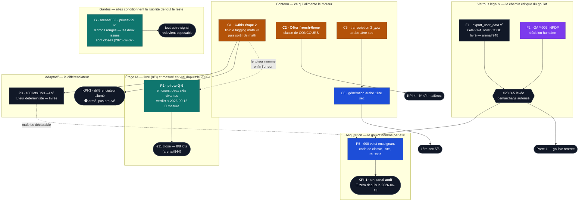

# ROADMAP — ordre d'exécution du reste-à-faire (études, lots, contenu)

<!-- roadmap-sync: since-pr=912 -->

> **Structure du 2026-08-24, contenu tenu à jour** (dernière passe : **2026-09-02**, §11).
> Déclinaison opérationnelle de l'**étude 26** (doctrine verticale : profondeur avant largeur).
> L'état de référence reste [STATUS.md](../STATUS.md) + l'[index des études](./README.md).
> ⚠️ **Le jalon produit — la rentrée, 1ᵉʳ septembre 2026 — est PASSÉ.** Ce fichier a longtemps
> compté les jours qui l'en séparaient (« J-8 ») ; il ne s'agit plus de l'atteindre mais de
> rattraper ce qui devait y être. La vue jalon est au §8, et elle se lit désormais comme un
> retard, pas comme un compte à rebours.
>
> **Ce fichier ne contient plus que le reste-à-faire.** Il pesait **1 190 lignes**, dont les deux
> tiers racontaient du travail terminé ; il en fait **la moitié**. Ce qui est livré vit désormais en
> **une ligne** au §8 (avec sa PR, pour le gate `check-roadmap-sync`) et les **leçons de méthode**
> que ces lignes portaient sont regroupées au §9 — aucune n'a été perdue, c'est la condition
> qu'a posée l'élagage.
>
> **Trois nouveautés de structure**, réclamées par la passe du 2026-08-24 :
>
> 1. **Le §1 est un graphe, pas une liste.** Trois files parallèles disaient dans quel ordre
>    prendre les lignes _à l'intérieur_ d'une file, et rien sur ce qui bloque quoi _entre_ les
>    files. C'est exactement l'angle mort qui a coûté dix-huit jours d'immobilité de la file
>    PRODUIT en août : elle attendait du **CONTENU**, et aucune ligne ne le disait.
> 2. **Le §2 distingue les horloges des chantiers.** Une mesure de deux semaines et une campagne
>    de contenu ne se « priorisent » pas comme un lot de code : leur coût est du **calendrier**,
>    pas de l'effort. À J-8, elles passent devant.
> 3. **Le goulot est nommé et son chemin critique est tracé.** La scorecard é28 dit depuis le
>    2026-08-13 que le projet bute sur **zéro canal d'acquisition**. Le chemin qui l'ouvre tient
>    en quatre nœuds, dont le premier — `export_user_data` — est **du code sans aucun
>    prérequis**. Il n'avait de ligne nulle part dans les trois files.

---

## 0. Mode d'emploi

1. **Une ligne = une session = un lot = une PR** (règles FableEtudes inchangées : cadre fermé,
   DoD intégral, la session suit sa PR jusqu'au merge réel).
2. **Lire le §1 avant de choisir**, puis prendre la première ligne non cochée de sa file dont
   les dépendances sont satisfaites. L'ordre inter-files est au §2.
3. **« Arbitrage rendu » ≠ « ligne exécutable ».** Vérifier aussi le **statut de l'étude**
   (`brouillon` / `validée` / `en exécution`) et ses questions internes.
4. **Relire l'issue (ou le code) avant de prendre la ligne.** Trente secondes. Deux priorités
   proclamées ici ont été refermées par d'autres pendant que le fichier les disait urgentes
   (§9, leçon L-1).
5. **Un statut se constate sur `main`, il ne se déduit pas.** La passe du 2026-08-24 a encore
   trouvé une étude entière donnée « en exécution » alors que ses cinq lots étaient livrés (é07).

---

## 1. Le graphe — ce qui bloque quoi

**Comment lire ce graphe — trois faits qu'il rend visibles et que les trois files cachaient :**

1. **Le goulot a un chemin critique de quatre nœuds, et son premier est TOMBÉ le 2026-09-02.**
   ~~`export_user_data`~~ → é28 D-5 → é08 enseignant → un canal d'acquisition. Aucune ligne de ce
   fichier ne le portait avant le 2026-08-24 : F5 le mentionnait comme « reliquat », et é08
   dormait en `brouillon` — **le nommer aura suffi à le faire prendre en une session** (arena#948).
   **D-5 n'attend donc plus que F2 (GAP-003), qui est humain** : le chemin est passé de « deux
   verrous dont un codable » à « un geste administratif ». **Tout le reste de la file PRODUIT
   raffine encore un produit que personne n'a vu.**
2. **Le contenu commande le produit, pas l'inverse.** Deux flèches partent de C1 vers l'étage
   adaptatif et l'étage IA. C'est la forme mesurée d'août : dix-huit jours de file PRODUIT à
   l'arrêt, levés en deux jours par une PR de **corpus** (#219).
3. **L'étage IA est complet, et il tourne enfin.** é29 (5 lots) et **é11 (8 lots sur 8, depuis
   arena#844 le 2026-08-24)** sont en production ; **les deux clés — famille et plateforme,
   DeepSeek des deux côtés — sont branchées et actives depuis le 2026-09-01**, avec du trafic
   réel confirmé sur les deux chemins (un aller-retour raté sur le chemin plateforme,
   retentable par construction, a résolu au deuxième essai). Le pilote Q-9 (§3 P2) est en
   cours de mesure, verdict attendu vers le **2026-09-15** — neuf jours après la rentrée, pas
   avant elle comme ce document l'espérait au 2026-08-24.

---

## 2. L'ordre — horloges d'abord, puis le chemin du goulot

> À J-8, deux natures de travail ne se comparent pas. Une **horloge** coûte du calendrier : on
> la lance, elle tourne seule, et la lancer tard ne se rattrape pas. Un **chantier** coûte de
> l'effort : il attend son tour sans se dégrader. Les horloges passent devant, quelle que soit
> leur valeur — c'est la seule décision que le calendrier prend à notre place.

### ⏱️ Rang 0 — les horloges, à lancer aujourd'hui

> **0.1 est partie le 2026-09-01**, neuf jours après le « aujourd'hui » qui l'annonçait —
> **après** la rentrée, pas avant : le risque que cette ligne nommait s'est en partie
> réalisé. Les deux clés (famille + plateforme, DeepSeek) sont vivantes, le trafic réel est
> confirmé sur les deux chemins, et le verdict des deux semaines de mesure est attendu vers le
> **2026-09-15**. Détail : §3 P2.

| #       | Ligne                                                            | Nature                        | Pourquoi maintenant                                                                                                                                                                                                                                                                                                                          |
| ------- | ---------------------------------------------------------------- | ----------------------------- | -------------------------------------------------------------------------------------------------------------------------------------------------------------------------------------------------------------------------------------------------------------------------------------------------------------------------------------------- |
| **0.2** | **C4bis étape 2** — finir `math` 9ᵉ, puis sortir de math (§5 C1) | campagne de contenu, semaines | Alimente **é30, é11 et la ligne 3 de la scorecard** à la fois. Le tagging couvre **662 des 818 questions (81 %)** — chiffre du lot 0bis de é30 (privé#241), les 156 restantes étant **statuées**, pas impayées — mais toujours **une seule matière**. Le précédent est chiffré : dix-huit jours de file PRODUIT à l'arrêt pour ce même motif |
| **0.3** | **C4ter — `french-6eme`** (§5 C2)                                | campagne de contenu, semaines | Une classe de **concours** amputée d'une épreuve. La fiche est transcrite depuis des semaines ; le seul motif du retard est qu'aucune session ne l'a prise (é28 D-4)                                                                                                                                                                         |

### 🎯 Rang 1 — le chemin critique du goulot

| #       | Ligne                                             | Pourquoi ce rang                                                                                                                                                                                        |
| ------- | ------------------------------------------------- | ------------------------------------------------------------------------------------------------------------------------------------------------------------------------------------------------------- |
| ~~1.1~~ | ~~**`export_user_data`**~~ (§4 F1)                | ✅ **Livré le 2026-09-02** (arena#948). Il tenait la Porte 1, é28 D-5, é08 et tout démarchage d'établissement — zéro prérequis, zéro arbitrage, et pourtant aucune ligne nulle part jusqu'au 2026-08-24 |
| ~~1.2~~ | ~~**Les 9 crons rouges**~~ — arena#833, privé#229 | ✅ **Les deux issues sont closes**, re-constaté le 2026-09-02. La chaîne d'ouverture de PR du corpus est réparée — les campagnes du rang 0 ne sont plus bloquées par là                                 |
| **1.3** | **GAP-003 / INPDP** (§4 F2)                       | Humain, non codable. **Désormais la SEULE moitié manquante de D-5** — depuis le 2026-09-02, plus rien de codable ne se tient entre le projet et le démarchage                                           |

### 🔨 Rang 2 — ce qui se prend ensuite, par file

| Rang | PRODUIT                                       | FONDATIONS                        | CONTENU                             |
| ---- | --------------------------------------------- | --------------------------------- | ----------------------------------- |
| 2    | ~~é11 lots 6-7~~ — **livrée** (arena#844, §9) | A15/A16 — recaler G-1/G-4         | C12 — فقه, 8 أبواب (🚧 en vol)      |
| 3    | ~~é30 lots 0bis → 4~~ — **livrée** (§9)       | A17 — Node 22 ou garde de diff    | C9 — محور 3 arabe 1ère sec          |
| 4    | é08 volet enseignant _(⛔ D-5)_               | é25 L7 — drill de portabilité     | C3 — génération arabe 1ère sec      |
| 5    | é20 lots 4 · 8 · 6                            | é24 lot 5 — purge historique      | C10 — petites classes (🚧)          |
| 6    | é26 lots 1-2 — la doctrine, enfin écrite      | F7 — deux majeures bloquées amont | C2 — vidéos maths 9ᵉ (é23 lot 5)    |
| 7    | —                                             | F6 — geste opérateur de triage    | C7/C8 — doctrines figures & manuels |

⚠️ **Ce que cet ordre ne dit pas, et qu'il faut savoir** : é26 est au rang 6 alors qu'elle est la
doctrine que **tous** les autres documents citent. Ses deux lots sont documentaires et
`docs/doctrine-verticale.md` **n'existe pas** (vérifié sur `main` le 2026-08-24). On exécute
depuis cinq semaines une doctrine qui n'a jamais été écrite normativement — elle ne vit que dans
son étude et dans les citations qu'on en fait.

---

## 3. FILE PRODUIT — la verticale V1 « apprendre & maîtriser »

> **La file V1 d'origine est close : 20 lignes sur 20.** Les études 04, 07 et 22 sont
> **terminées**, é02 est livrée, é29 est livrée. La boucle d'apprentissage n'a plus de dette
> adaptative. Ce qui suit est **l'étage IA et ce qui vient après V1**.

- [ ] **P2. Le pilote Q-9 — deux semaines de mesure, en cours depuis le 2026-09-01.** ⏱️ **Rang 0.**
      C'est le seul reste-à-faire de é29, et c'est aussi la condition que é11 s'est posée à
      elle-même — jusqu'ici testé contre un transport factice (c'est la règle du §5 de é29 et
      aussi sa limite). **Les deux clés sont maintenant branchées et vérifiées en trafic réel** :
      la clé famille (Réglages `/parametrage`, BYOK) et la clé plateforme (Vercel
      `AI_PLATFORM_API_KEY`/`AI_PLATFORM_PROVIDER`, redéployée) — les deux sur **DeepSeek**,
      confirmées par `/admin/ia` (bloc « clé plateforme »). Le chemin plateforme a buté une fois
      sur le message générique retry-safe (« El Ostedh est en pause » — PAS le message de clé
      invalide, qui nomme le porteur de clé) puis a répondu au deuxième essai — cohérent avec un
      429/5xx transitoire du fournisseur, pas une mauvaise configuration.
      **Verdict attendu vers le 2026-09-15** (deux semaines après le départ réel, pas après le
      2026-08-24 comme espéré alors — la rentrée est passée sans preuve, le risque que ce
      document nommait au 2026-08-24). **Le protocole du pilote est au §5 de é29** ; il n'est pas
      à réinventer ici.
      ⚠️ **Reliquat de P1 (é11 lots 6-7, livrés par arena#844 le 2026-08-24) : l'état de é11 ne
      se lit toujours pas dans son propre document** — ses huit cases de §4 restent vides et son
      §8 dit encore « aucun lot commencé » (vérifié le 2026-09-01). L'inventaire fait foi dans
      `STATUS.md`. **La session qui clôt l'étude (après le verdict du pilote) resynchronise son
      en-tête et déplace son dossier vers `EtudeRealisé/`.**

- [ ] **P4. é20 — réponses acceptées : lots 4, 8 et 6.**
      **Lot 4** — campagne Tier B, une matière par PR, à décider sur la base du pilote (#96,
      `math-1ere/07-reperage-espace`, 25 questions sur 30 couvertes). **Lot 8** — pilote contenu
      `short_answer` : **corpus livré le 2026-09-01, appliqué en prod le jour même** — la doctrine
      R-13/R-14 ouvre le type dans `content-engine`/`content-interactif`/`prof-math-9eme`, et le
      sixième type natif est enfin **joué** : **119 questions libres, une par exercice**, sur les
      119 missions des 20 chapitres de `math` 9ᵉ, zéro dans les `quiz.json`. Reste la **mesure**
      du pilote (signalements, sweep `content-audit`), puis l'accord de Mohamed pour ouvrir le
      type aux autres matières. **Lot 6** (optionnel) — boucle du refus contesté.
      **Dette remontée par le pilote** : Tier A produit « الفوقها » en préfixant « ال » sans
      condition — inoffensif au scoring, mais il consomme la borne des 24 variantes. Candidat à
      un lot moteur.

- [ ] **P5. é08 — volet enseignant.** ⛔ **Précondition dure é28 D-5** : GAP-024 **et** GAP-003.
      Sortie de la file différée V4 le 2026-08-13 (é28 Q-3) : code de classe, liste d'élèves,
      taux de réussite par chapitre. Motif — c'est le **seul canal à CAC ≈ 0** au budget réel
      (1 000-2 000 TND/an), donc le chemin le plus court vers KPI-1.
      ✅ **Re-scopage FAIT le 2026-08-24.** Le §0 de l'étude trie les huit US de 2026-07-04
      ligne à ligne — **six sont livrées ou périmées** — et renvoie l'écran livré à
      `docs/suivi-parental-quotidien.md`, qui en est désormais la spec normative ; le wording
      « premium » est supprimé. **Ce qui reste de P5** = les lots 4·5·6 de l'étude (classes +
      code + adhésion, puis liste + taux par chapitre, puis le devoir). La portée exacte de
      D-5 — prospection seule, ou aussi construction ? — est posée en **Q-4**, à trancher
      avant le lot 4.
      💡 **Trois lots parent en sont sortis, sans précondition et exécutables tout de suite** :
      l'examen blanc au rapport (é02 est livrée, `get_mock_exam_percentile` existe et rien ne
      le montre au parent), le digest hebdo enrichi opt-in (le push dominical est toujours le
      générique), et le comparatif de parcours seuillé (jamais construit).

- [ ] **P6. é26 lots 1 et 2 — écrire la doctrine qu'on applique.**
      **Lot 1** : `docs/doctrine-verticale.md` (P-1…7, grille M0-M4, Definition of Excellence,
      règle d'arbitrage, doctrine IA-native) + ancrage canonique dans AGENTS.md + fiche D-2 dans
      `_TEMPLATE.md` + règle de création d'étude dans `FableEtudes/README.md`.
      **Lot 2** : « Ordre d'exécution recommandé » de l'index réécrit (il porte encore un
      avertissement « périmé depuis le 2026-07-20, conservé jusqu'à sa réécriture par le lot 2 »),
      statuts gelés actés dans les en-têtes de 06/10/12, colonne « M » dans STATUS.md §3.
      🔴 **Vérifié le 2026-08-24 : `docs/doctrine-verticale.md` n'existe pas.** Deux lots
      documentaires, aucun prérequis, cinq semaines d'exécution qui les citent.

- [x] **P7. é31 — l'envie de revenir (engagement & rétention) : LIVRÉE EN PRODUCTION
      le 2026-09-03** (arena#949, squashée sur `main` en `7bdbccd`).
      Chaque lot porte sa migration, ses assertions pgTAP et ses tests co-localisés ;
      `npm run verify`, `build:check` et `smoke:shell` sont verts, et la suite pgTAP complète
      (96 fichiers, 1 363 assertions) a été rejouée en local sur la chaîne entière.
      **Trois écarts assumés au contrat**, tous nommés dans les commits et la PR : une table
      de consentement push (l'opt-out n'était comptable par AUCUNE colonne, or US-13 le
      demande) ; un compteur d'XP du jour tenu dans `award_xp` (R-12 exige l'XP réel, et
      `attempts` ignore donjon, duels et objectifs) ; une RPC self-scopée pour « Ta semaine »
      plutôt qu'un appel à `get_tutor_digest_inputs`, qui est `service_role` et
      dépersonnalisée. **Un stop-point remonté** : la fenêtre de rachat de série diverge de
      ce que l'étude suppose — `streakRecoveryBlock` n'a aucune borne haute, un élève parti
      depuis dix jours peut encore racheter. Rien n'a été changé : le coût et la fenêtre du
      rachat sont l'arbitrage A16 de é09.
      **Deux défauts trouvés par le harnais pgTAP local, avant la CI** : un `GRANT` recopié
      d'un fichier source rouvrait la faille S1 (auto-crédit de pièces), et
      `award_duel_rewards` — second écrivain de `hero_class` — faisait échouer chaque
      récompense de duel après le passage aux codes. Les deux sont corrigés, et chacun a
      désormais son assertion.
      Écrite et **validée le 2026-09-01** (`FableEtudes/EtudeRealisé/31-envie-de-revenir/`, Q-1…Q-4
      arbitrées : opt-in inchangé · 4 événements dont Ramadan · classement hebdo par
      défaut · 30 pièces de bienvenue). Rallumer ce
      qui existe avant d'ajouter : mesure de rétention (le lot 1 publie enfin é26 KPI-4 —
      STATUS KPI-2 🔴), badges vivants (9/13 morts), missions rotatives + anneau honnête,
      push localisés + relance de l'élève qui a perdu sa série (aujourd'hui plus jamais
      recontacté), ligue célébrée + classement « cette semaine », accueil D0, identité,
      calendrier scolaire. 8 lots, zéro nouvelle route élève, zéro clé IA.
      ⛔ Porte restante : é26 KPI-3 (≤ 3 études en exécution —
      plafond déjà dépassé aujourd'hui) ; toute valeur d'économie passe par é09 (§3.9 de
      l'étude). Ne bloque rien ; le goulot du projet reste l'acquisition (§8, axe Marché),
      pas la rétention — cette étude prépare la rétention de ceux que l'acquisition amènera.
      ⚠️ **Un dernier défaut, trouvé par CodeQL sur la PR** : la regex qui cherchait les
      appels `trackProductEvent(…)` dans le test « zéro PII » rétrogradait exponentiellement
      (`js/redos`, HIGH). Remplacée par un balayage qui compte les parenthèses — linéaire, et
      plus juste : la version régulière tronquait un appel dont un argument contenait une
      parenthèse, donc elle pouvait manquer une propriété interdite.
      ⚠️ **Ce qui reste, et qui n'est pas du code** : relever la CURR en prod (la scorecard
      §1bis attend un chiffre daté, pas un instrument — il sortira n = 0 tant que la ligne 1
      tient), et déplacer le dossier de l'étude en `EtudeRealisé/`.

---

## 4. FILE FONDATIONS (parallèle — ne bloque pas la file produit)

- [x] **F1. `export_user_data` — le dernier volet CODE de GAP-024.** ✅ **Livré le 2026-09-02
      (arena#948).** Le volet CODE du GAP est complet : pages légales `/confidentialite` et
      `/conditions` (arena#701, deux **URL stables**), **suppression de compte** (arena#791), et
      désormais l'**accès / portabilité** — qui était encore à zéro occurrence dans `src/` et
      `supabase/migrations/` le matin même.
      **Ce que la solution retenue apporte au-delà de la ligne** : la RPC ne récite pas une liste
      de tables, elle **dérive `pg_constraint`** — toute table de `public` portant une FK vers
      `auth.users` est un endroit où la personne existe, donc une table créée demain entre dans
      l'export sans que personne n'y pense. C'est l'argument que la suppression avait déjà tranché
      (arena 20260819170000) : une liste écrite à la main serait vraie le jour de sa PR et fausse
      **en silence** à la suivante, et un export incomplet ressemble trait pour trait à un export
      complet. Le fail-closed est explicite : une colonne d'un nom inconnu sort de l'export, est
      **nommée dans le document**, et fait **échouer** le pgTAP 85 — L-2 traitée à la source plutôt
      que constatée après coup.
      ⚠️ **Le double piège de ce GAP, et il a coûté douze jours dans chaque sens** : une PR qui
      **cite** un GAP dans son titre ne le clôt pas ; et un GAP qu'**aucune PR ne cite** peut
      avoir été livré quand même (arena#791 s'intitule « un compte peut enfin être supprimé »,
      sans un mot de GAP-024).
      **Reste de GAP-024, et ce n'est plus du code** : l'identité de l'éditeur pour des mentions
      légales complètes.
      ⚠️ é29 §3.8 ajoute une pièce au dossier : un **registre de traitement INPDP** pour le mode
      IA. Il rejoint la démarche F2 plutôt que d'en ouvrir une.

- [ ] **F2. GAP-003 — conformité mineurs / INPDP.** 🎯 **Rang 1, et depuis le 2026-09-02 le
      SEUL.** Décisions juridiques, non codables, **non vérifiables depuis un dépôt**. F1 étant
      livrée, c'est le dernier prérequis légal du lancement, quel que soit le modèle gratuit —
      plus rien de codable ne se tient entre le projet et le démarchage.
      Restent dans le même dossier : l'identité d'éditeur pour des mentions légales complètes,
      et la décision « français seul ou trilingue » — traduire un engagement juridique sans
      relecture lui ferait dire autre chose.

- [x] **F3. arena#833 — 7 crons rouges, ouverte le 2026-08-24.** ✅ **Close**, re-constaté le
      2026-09-02. L'issue avait été ouverte **par la garde des gardes** livrée deux jours plus tôt
      (arena#831) — elle a fait exactement son travail, de bout en bout. Voir §9, leçon L-2 : la
      série est à quatre cas, aucun n'était une surprise pour qui regardait l'onglet Actions.

- [x] **F4. privé#229 — `auto-pr.yml` ne peut pas ouvrir de PR.** ✅ **Close**, re-constaté le
      2026-09-02. Le pendant privé d'arena#832 (le PAT n'avait pas la portée `actions:write`). Il
      bloquait le rang 0 — les campagnes de contenu livrent par PR — et ce blocage-là est levé.

- [ ] **F5. A15 / A16 — recaler les garde-fous d'économie.** Deux arbitrages humains produits
      par la mesure (arena#708), en attente depuis le **2026-08-03**. Détail au §6.
      ⚠️ **A15 n'est pas neutre à laisser en attente** : tant que G-1 reste au tableau,
      `economy:check` échoue **par construction**, et un garde-fou qui échoue toujours cesse
      d'être lu — c'est le mécanisme exact de L-2.

- [ ] **F6. A17 — Node 22 ou une vraie garde de diff de dépendance.** Détail au §6. Le statu quo
      (Node 24 partout) est l'option qui a **déjà coûté** 33 h de Content CI rouge.

- [ ] **F7. é25 lot 7 — drill de portabilité.** Dernier lot de l'étude harness (les six autres
      sont livrés). **À faire avec Mohamed**, session hors file. C'est ce qui la fermerait.

- [ ] **F8. é24 lot 5 — purge de l'historique git public.** Volontairement **reporté à une
      fenêtre calme constatée**. Conséquence assumée : le KPI §1 de é24 n'est atteint qu'au
      **tip**, pas dans l'historique, où le corpus de mai→juillet 2026 reste lisible — couvert
      explicitement par `LICENSE-CONTENT.md`. **Lot 6 partiel** : catalogue TEST restauré, reste
      la tier e2e authentifiée. **Q-4** (OTDAV/INNORPI) ouverte, démarche humaine.

- [ ] **F9. Deux majeures, bloquées en amont.** **arena#660** — `typescript` v7.0.2, gate rouge,
      `typescript-eslint` incompatible : attendre l'amont, ne pas forcer. **arena#595** — aligner
      `@types/node` (v26) sur le runtime CI, **passé à Node 24** (arena#688), pas 26.
      ⚠️ #660 remplace #593, close.

- [ ] **F10. Le geste opérateur de triage** (arena#673). Plus aucun blocage technique :
      `report-triage.yml` tourne 6×/jour et va jusqu'à la PR, et sa panne de 25 jours est
      corrigée (arena#824 — l'URL prod vient du dépôt, plus d'un secret ; un run rouge ouvre une
      issue de suivi). Reste à appliquer depuis `/admin/content-reports` et `/admin/bug-reports`
      les `dismissed` recommandés.
      ⚠️ **Ne pas fermer #673 sans traiter la file** : ses UUID canoniques tiennent les
      signalements hors du chemin « fresh reports » du pré-gate.

- [ ] **F11. Deux gestes de console qui restent dus.**
      (1) **Coller les 3 gabarits d'e-mail FR** dans Supabase — aujourd'hui le premier contact du
      produit avec un parent part **en anglais**.
      (2) Vérifier qu'un événement `web_vitals` **arrive réellement** dans PostHog — sans clé le
      beacon n'émet rien, et un tableau de bord vide se lit à tort « aucun problème ».

---

## 5. FIL CONTENU (parallèle — sessions de campagne dédiées)

- [ ] **C1. C4bis étape 2 — finir le tagging des misconceptions.** ⏱️ **Rang 0.**
      **Étape 1 livrée** le 2026-08-22 (privé#219) et **appliquée en prod** le 2026-08-23
      (`apply-content.yml`, run 32629700267) : **1 049 distracteurs tagués**, registre passé de
      56 à **154 entrées**, toutes pourvues de leur `competency`, sur les 20 chapitres de
      `math` 9ᵉ.
      **Ce qui reste, et c'est le rang 0 :**
      (a) le tagging couvre **662 des 818 questions de `math` 9ᵉ — 81 %** depuis le lot 0bis de é30 (privé#241), les 156 muettes restantes étant **décidées** sous une règle écrite. Arbitrage Q-5 du
      2026-08-23 : trancher si les 297 autres sont **légitimes** (tout distracteur n'encode pas
      une erreur nommable) ou un **reliquat**. La réponse se donne en lisant un échantillon, pas
      en décidant a priori.
      (b) le tagging **s'arrête à `math` 9ᵉ**. é30 comme la scorecard demandent d'en sortir —
      `math-6eme` est le suivant naturel (classe de concours, 805 questions déjà taguées en
      compétences par C4).
      ⚠️ **Armé n'est pas prouvé** : `user_misconceptions` est encore **vide** en production.
      Elle ne se remplira qu'avec des élèves qui ratent des questions taguées. La ligne 3 de la
      scorecard reste 🟠 tant que ce n'est pas mesuré — **à re-sonder en prod**.

- [ ] **C2. C4ter — `french-6eme`, compléter la classe de CONCOURS.** ⏱️ **Rang 0.**
      _(é28 Q-2/D-4, arbitré le 2026-08-13.)_
      **Le fait** : la 6ᵉ a **3 matières avec du contenu** (math, arabe, éveil) pour **6 fiches
      de programme transcrites**. Le **français a sa fiche et zéro contenu** — sur une classe
      dont le français est une **épreuve du concours**.
      **Ce n'est pas un blocage de source** : depuis l'amendement **R-5 du 2026-07-29**, une
      fiche `partielle` ne bloque plus la matière — on génère **chapitre par chapitre**, sur les
      seules sections transcrites à profondeur de génération. Le seul motif du retard est
      qu'aucune session ne l'a prise.
      **Barre inchangée** : é18 axes 1-5, gates contenu, audit indépendant. La priorité change,
      pas la qualité (é28 RISK-4). Une matière se livre **entière ou par tranches ≤ 4 chapitres**,
      jamais en échantillon vitrine.
      **Ensuite, dans le même esprit** : les deux autres matières de 6ᵉ sans contenu (anglais,
      islamique), puis la vérification que la 9ᵉ tient la barre é18 sur ses 6 matières. Le **Bac
      n'entre pas ici** — cinq de ses six sections n'ont aucune fiche transcrite, c'est un LOT A
      de transcription et un chantier **septembre→janvier** (é28 D-6).

- [ ] **C3. C12 — sous-rubrique فقه, « الرسالة » d'Ibn Abî Zayd. 🚧 EN COURS.**
      État constaté sur `origin/main` le **2026-08-24** : **37 أبواب livrés** (01 → 32, 34, 36,
      38, 41, 42), rattachés à leur livre, et **la rubrique est ouverte aux élèves**
      (arena#738 puis arena#741, parcours `education-islamique` passé `coming_soon` →
      `available`).
      **Reste 8 أبواب sur 45** : 33, 35, 37, 39, 40, 43, 44, 45. Une session concurrente en
      traite quatre (33, 37, 43, 44) au 2026-08-24 — **se coordonner avant d'en prendre**.
      ⚠️ **À ne pas relire comme une classe** : c'est une rubrique **Extras**. Elle ne concourt
      ni à la barre é18 par classe, ni à « classe de concours entière d'abord » (é28 D-4) — elle
      ne passe **pas** devant C1 ni C2.

- [ ] **C4. C10 — campagne petites classes. 🚧 EN COURS** depuis le 2026-07-26.
      Livré : `french-4eme` (00→05), `french-5eme` (modules 1→8), `arabic-6eme` unité 1
      (7 chapitres + audit indépendant + correction intégrale), `education-islamique-5eme`
      (10 chapitres, plus huit retouches d'audit), `math-bac-math` ch.16-19,
      `arabic-2eme-sec-lettres`, et la fiche 6ᵉ base (`eveil` p.20→70, `arabe` à la barre R-5).
      ⚠️ **Générer n'est pas ouvrir** : aucune classe n'est visible des élèves tant qu'une **PR
      moteur** ne l'ouvre. ⚠️ **Et générer n'est pas appliquer** : la garde `content-drift`
      mesure l'écart depuis le 2026-08-04. Du contenu généré et jamais appliqué est du travail
      **invisible pour l'élève**.
      ⚠️ **Dette d'audit connue** : les 7 chapitres d'`arabic-6eme` ont été publiés **avant**
      l'audit qui a trouvé 7 bloquants dont une règle d'orthographe fausse. Lancer
      `content-audit` **avant** d'ajouter des chapitres, pas après.

- [ ] **C5. C9 — transcriptions du secondaire (fil continu, `METHODE-GENERATION-CONTENU.md`).**
      **Reste** : le **محور 3 d'arabe 1ère sec** — seul verrou de C6 · `math-2eme-sec-sciences`
      (12 chapitres sur 19) · la suite du lycée. `philosophie bac` a avancé le 2026-08-23
      (privé#225 : محور 3 transcrit et validé R-7, 3 chapitres sur 5 générables).
      **La campagne de GÉNÉRATION lycée massive est débloquée** — anglais 3ᵉ sec sert six classes
      d'un coup, anglais bac six terminales.

- [ ] **C6. C3 — é16 vague A : 1ère sec, il reste `arabe`.**
      En production au 2026-08-04 : math, physique, SVT et **français**. **Bloqué à la source** :
      la fiche de programme d'arabe est `partielle`/`first-pass`, génération interdite tant que
      le **محور 3** n'est pas transcrit — c'est **C5**, pas une tâche de génération.
      ⚠️ **Ne pas lire « 1ère sec = 4/5 » comme « la classe est à moitié vide »** : elle compte
      **6 matières en ligne**, chimie et anglais s'étant ajoutés hors vague A. Chiffres relus sur
      `origin/main` : chimie **2 chapitres codifiés sur 11**, anglais **6 sur 35**, français
      **7 sur 7**. Le tableau de suivi annonçait « 35/35 » — une session qui lit « LIVRÉ » saute
      la matière, et **38 chapitres partiraient en silence**.

- [ ] **C7. C2 — é23 lot 5 : campagne vidéos maths 9ᵉ**, puis extension aux autres matières de
      concours au fil de l'eau. Débloquée depuis le 2026-07-19 (Q-1 arbitrée, skill
      `content-videos` et health-check livrés). **Toujours rien de fait.**

- [ ] **C8. C6 — illustration, backlog é18** (ordre petites-classes-d'abord) : 4ᵉ puis 5ᵉ année
      (toutes matières visuelles) → maths 7ᵉ (5 ch.) → maths 9ᵉ fonctions+stats (2) →
      iq-training (3) → français (1). **Entamé** : 10 figures « objet réel » en `eveil-2eme` et
      **23 figures** de la campagne animaux sur 1ᵉʳ → 4ᵉ année. Le reste de la liste est inchangé.

- [ ] **C9. C7 — é19 lot 1 : doctrine + gate figures de questions**, puis campagne (concours
      d'abord : 6ᵉ/9ᵉ/bac). _(A3 rendu : SVG inline seul, vérification intégrale, un lot >
      ~40 figures se scinde et ne s'échantillonne jamais.)_ **780 questions illustrées sur
      18 708.**

- [ ] **C10. C8 — é21 lot 1 : doctrine manuels**, puis pilote `math-1ere-sec` (exercices tracés
      `manuel_ref`, rapport de couverture). _(A4 rendu : verbatim court non créatif toléré,
      provenance **non** affichée à l'élève, lot 3 abandonné.)_
      ⚠️ **Son point de départ a changé, pas sa ligne** : F13 (§8) a livré la **déclaration** des
      60 volumes et la **surface de lien** — pas les exercices tracés ni le rapport. À mesurer
      avant d'écrire.

- [ ] **C11. Appliquer en production ce qui est généré.** Ligne **récurrente**, pas un chantier :
      la garde `content-drift` mesure l'écart, un dispatch d'`apply-content.yml` le referme.
      ⚠️ Nuance à ne pas confondre avec « générer n'est pas ouvrir » : un parcours **déjà ouvert**
      (5ᵉ base depuis le 2026-06-20) ne demande **aucune PR moteur** — seulement un run.

---

## 6. Arbitrages en attente

> Les arbitrages **A1→A14** sont rendus et leurs conséquences sont dans les études concernées ;
> ils ne sont plus recopiés ici. **Ne restent que ceux qui attendent une décision.**

| #                | Constat mesuré                                                                                                                                                                                                                                                                                     | Ce qui est à trancher                                                                                                                                                                                                                                                                                                                                | Depuis     |
| ---------------- | -------------------------------------------------------------------------------------------------------------------------------------------------------------------------------------------------------------------------------------------------------------------------------------------------- | ---------------------------------------------------------------------------------------------------------------------------------------------------------------------------------------------------------------------------------------------------------------------------------------------------------------------------------------------------- | ---------- |
| **A15**          | **G-1 (« niveau 5 en 7-14 j ») échoue des DEUX côtés** : l'assidu l'atteint au jour 6, le moyen au jour 31. À 3 j/semaine × 2 exercices, 800 XP demandent ~5 semaines — le seuil est arithmétiquement hors d'atteinte pour le persona moyen                                                        | **Recaler G-1** : une fenêtre par persona, ou une cible qui décrive le moyen. ⚠️ **Ne PAS retoucher `gamification.ts` pour faire passer le test** — ce serait régler l'outil                                                                                                                                                                         | 2026-08-03 |
| **A16**          | **G-4 (shields ≤ 20 % des jours manqués) échoue à 38 %.** Celui-là est un **signal d'économie**, pas un seuil trop serré : à 15 coins, le rachat de série est bon marché face au revenu                                                                                                            | Desserrer le seuil **ou** renchérir le shield. La revue est **mensuelle** (A9) — rien n'oblige à trancher ce jour                                                                                                                                                                                                                                    | 2026-08-03 |
| **A17**          | **L'alignement sur Node 24 a supprimé le seul détecteur** qui ait attrapé une majeure + une alpha entrées sous un titre de « bump indirect » (arena#716). La propriété perdue était **accidentelle** — la sévérité de npm 10 — donc fragile, mais elle a fonctionné là où tout le reste était vert | **Revenir à Node 22** (garder le canari, au prix de faire tourner les scripts du moteur sur un Node qu'il n'utilise pas) **ou tenir Node 24** et poser la vraie garde : refuser une PR de dépendance dont le **diff dépasse ce que son titre annonce**. ⚠️ Ne pas trancher par confort : le statu quo est l'option qui a déjà coûté 33 h de CI rouge | 2026-08-10 |
| **Q-5 é30 / C1** | Le tagging de `math` 9ᵉ couvre **64 %** des questions                                                                                                                                                                                                                                              | Les 297 non taguées sont-elles **légitimes** ou un **reliquat** ? Se tranche en lisant un échantillon                                                                                                                                                                                                                                                | 2026-08-23 |

**Ce qui reste à la main de Mohamed, hors lots** : é23 Q-3 (self-désigner l'app child-directed
auprès de Google — le paragraphe « vidéos YouTube » a désormais une page où vivre, arena#701) ·
é24 Q-4 (démarche OTDAV/INNORPI) · **F1/F2** (légal avant rentrée) · le geste opérateur de triage
(**F10**) · les gabarits d'e-mail FR (**F11**) · le drill de portabilité de é25 (**F7**).
✅ **Brancher une clé pour le pilote Q-9 est fait** — les deux clés (famille et plateforme,
2026-09-01) ; reste seulement à attendre son verdict (§3 P2).

---

## 7. Différées & gelées (ne rien lancer avant leur porte)

| File                                  | Porte d'entrée                                 | Contenu                                                                                                                                                                                                                                                                                                                                                   |
| ------------------------------------- | ---------------------------------------------- | --------------------------------------------------------------------------------------------------------------------------------------------------------------------------------------------------------------------------------------------------------------------------------------------------------------------------------------------------------- |
| **V2 — concours**                     | ~~levée le 2026-08-13~~                        | **é02 est livrée et close** (arena#743, #746). Les **annales** restent un enrichissement, chantier de **contenu non ouvert** : qui le lance entre en file CONTENU (§5), pas ici. Reliquats portés par son §8 : Q-2 (cadence éditoriale = mitigation de RISK-1), Q-4 (lot 6 optionnel) et **Q-5 — vérifier en base que la session 1 est bien `published`** |
| **V4 — parent**                       | ~~levée le 2026-08-13~~                        | **é08 s'est re-scopée le 2026-08-24** sur son volet enseignant → §3 P5. Le volet **parent** ne part plus de zéro (F11 au §8) : il ne lui reste que quatre reliquats, dont trois sans précondition. ⛔ Précondition dure é28 D-5 : **F1 + F2**                                                                                                             |
| **Gels doctrine** (A1-Q3, 2026-07-20) | Dégel par décision humaine explicite           | é06 (PWA offline) · é10 (anti-fraude — se dégèle au **volume réel** de V3) · é12 (studio d'ingestion in-app)                                                                                                                                                                                                                                              |
| **Gel de phase**                      | Sortie de la phase gratuite (décision humaine) | é01 (paiement en ligne — véhicule de réactivation du premium)                                                                                                                                                                                                                                                                                             |
| **Brouillon non ouvert**              | Q-1…Q-5 à arbitrer                             | é27 (sources web tierces) — sert le trou physique-chimie lycée ; **ne dégèle pas é12** ; son lot 2 (garde anti-verbatim) est **déjà livré** dans `content:qa` (arena#722)                                                                                                                                                                                 |

---

## 8. Vue jalon — ce qui doit être vrai le 1ᵉʳ septembre 2026

| Axe            | Cible rentrée                                                                                                                                               | État au **2026-09-02 (J+1)**                                                                                                                                                                                                                                                                                                              |
| -------------- | ----------------------------------------------------------------------------------------------------------------------------------------------------------- | ----------------------------------------------------------------------------------------------------------------------------------------------------------------------------------------------------------------------------------------------------------------------------------------------------------------------------------------- |
| **Produit**    | La boucle d'apprentissage à M3 : parcours réparé · Révision du jour · correction riche · Rappel tolérant · maîtrise visible · points faibles élève + parent | 🟢 **Atteinte, et au-delà.** La file V1 est **close (20/20)** ; **é04, é07, é22, é11 (8/8 lots, arena#844) et é30 (périmètre retenu) sont livrées**, é02 et é29 livrées. Reste hors cible : le verdict du pilote Q-9 (§3 P2)                                                                                                              |
| **IA**         | é11 dégelée, socle posé, un premier écran pédagogique                                                                                                       | 🟢 **L'étage est bâti ET mesuré** : é29 (5 lots) + é11 (8 lots sur 8) en production. Les deux clés (famille + plateforme, DeepSeek) sont branchées depuis le **2026-09-01**, trafic réel confirmé sur les deux chemins. 🟠 **Verdict du pilote Q-9 attendu ≈ 2026-09-15** — un étage éprouvé une semaine n'est pas encore un actif mesuré |
| **Contenu**    | Classes existantes à la barre é18 · 1ère sec complète · vidéos 9ᵉ · Tier A sur le corpus entier                                                             | 🟠 **C4bis appliqué en prod** (`math` 9ᵉ publiée le 2026-08-25 : 818 questions, **662 taguées — 81 %**) mais toujours **une seule matière**. **6ᵉ à 3/4** — le français manque. **1ère sec à 4/5** — l'arabe est bloqué par une transcription. **Vidéos 9ᵉ : rien.** Tier A : corpus entier ✅                                            |
| **Fondations** | `main` verte · légal · triage en route · domaine et monitoring                                                                                              | 🟢 **Atteinte.** `main` verte, domaine et monitoring soldés, **`export_user_data` livré** (arena#948) — le volet CODE de GAP-024 est complet — et les **9 crons rouges** sont refermés (arena#833, privé#229). Reste hors code : GAP-003 / INPDP                                                                                          |
| **Marché**     | ≥ 1 canal d'acquisition ouvert et mesuré                                                                                                                    | 🔴 **Zéro, depuis le 2026-06-13.** C'est **le goulot** — et depuis le 2026-09-02, son chemin critique ne commence plus par du code : F1 est livrée, il ne reste que F2 (GAP-003), qui est humain (§1)                                                                                                                                     |

---

## 9. Livré — index à une ligne

> Le gate `check-roadmap-sync` a un avis sur la **connaissance**, jamais sur le statut : citer
> suffit — coché, reporté ou sans objet. Cette section porte les citations ; le récit de chaque
> lot vit dans le §8 de son étude, et les leçons durables au §10.
>
> ⚠️ **La base déclarée ci-dessus est `since-pr=832`.** Déplacer une base sans citer ce qu'on
> saute est la faute exacte du 2026-08-22 (60 PR déclarées « connues » d'un coup). Les lots
> livrés entre l'ancienne base et celle-ci sont donc cités nommément ci-dessous.

**Études closes** — leur dossier est dans [`EtudeRealisé/`](./EtudeRealisé/) :

| étude                                     | lots                                                       | PR                                               |
| ----------------------------------------- | ---------------------------------------------------------- | ------------------------------------------------ |
| **02** examen blanc                       | 4 lots, 3 écarts assumés                                   | arena#743 · arena#746                            |
| **03** types de questions natifs          | complète                                                   | —                                                |
| **04** moteur adaptatif                   | A0 · A1.1 · A1.2 · A2                                      | arena#581 · #689 · #691 · #695 · #707 · **#818** |
| **05** duels & ligues                     | 5 lots                                                     | —                                                |
| **07** knowledge graph & maîtrise         | **5 lots sur 5** — lot 3 = C4 (1 362 questions taguées)    | arena#366 · #579 · #588 · **#616** · #617        |
| **13** moteur de transcription            | ScribeKit, dépôt autonome                                  | —                                                |
| **14** refonte UX/design                  | complète                                                   | —                                                |
| **15** contenu & composition des écrans   | 14 lots                                                    | —                                                |
| **17** rappel actif                       | 5 lots                                                     | —                                                |
| **18** cours vivants                      | 5 lots                                                     | —                                                |
| **22** parcours élève & progression       | 6 lots                                                     | arena#538 · #540 · #547 · #565 · #567 · #573     |
| **28** stratégie de référence             | 3 lots                                                     | privé#155 · #156 · arena#726                     |
| **29** mode IA « à la clé de la famille » | **5 lots** — porte, coffre, activation, la Forge, consoles | **arena#807** · #811 · #812 · #813               |
| **30** tuteur déterministe                | périmètre 0bis · 1 · 2 · 3 · 3bis · 4                      | privé#241 · arena#856 → #860 · #910 · #911       |
| **31** l'envie de revenir                 | **8 lots** — mesurer · rappeler · célébrer · rythmer       | **arena#949** · privé#324 · #328                 |

**Chantiers de fondations livrés** (hors étude — ils n'ont pas de dossier `FableEtudes/`) :

- **F1 · `export_user_data`** — le volet CODE de GAP-024 est complet (arena#948, 2026-09-02) :
  RPC `SECURITY DEFINER` sans paramètre, dérivée de `pg_constraint`, contrat en pgTAP 85 et
  section « Mes données » de `/parametrage`. Le premier nœud du chemin critique du goulot.
- **F3 · arena#833** et **F4 · privé#229** — les 9 crons rouges : **les deux issues sont closes**
  (re-constaté le 2026-09-02).

**Études encore ouvertes dont des lots sont livrés** :

- **é09** économie du jeu — lots 1 et 2 livrés (arena#703, **arena#708**) ; lot 3 conditionnel (§4).
- **é11** tuteur IA — **8 lots sur 8 livrés** (arena#816, #817, **arena#823**, **arena#844**) ;
  reste sa **mesure** — le pilote Q-9 est en cours depuis le 2026-09-01, verdict ≈ 2026-09-15
  (§3 P2). Son propre document (`ETUDE.md`) n'est toujours pas resynchronisé (§3 P2, note).
- **é30** tuteur déterministe — **le périmètre retenu (0bis · 1 · 2 · 3 · 3bis · 4) est LIVRÉ le
  2026-08-25** : lot 0bis au corpus (privé#241 — les 297 questions muettes tranchées, couverture
  **64 % → 81 %**, les 156 restantes **statuées** par une règle écrite, pas oubliées), puis les
  cinq lots moteur (**arena#856** socle de croyance BKT · **#857** inférence + relevé de perf ·
  **#858** lectures & carte à 4 états · **#859** le pack du tuteur apprend la maîtrise
  (amendement D) · **#860** la décision + cause racine). **Q-4 tranché et exécuté le 2026-08-30**
  (arena#910 retire l'écrivain, **arena#911** fait tomber `difficulty_adaptation`, arena#912 le
  topo ; étude à jour privé#263). **Restent différés, pas gelés** : lots 5·6·7·8·9 (échafaudage,
  charge cognitive, bilan d'entrée, consoles, échafaudage écrit) — Q-7 les rouvre quand la
  charpente aura rencontré un public. ⚠️ Deux corrections du **corps** de l'étude restent
  ouvertes en privé#247.
- **é16** ouverture lycée — lots 0-3 livrés (arena#367/#369/#371/#375) ; reste la campagne (§5 C6).
- **é20** réponses acceptées — lots 1·2·3·5·7 livrés (arena#583, #652, privé#96, arena#655, #654)
  et le lot 8 corpus (doctrine + 119 questions libres sur `math` 9ᵉ) ; reste sa mesure.
- **é23** vidéos explicatives — lots 1-4 livrés (arena#507/#510/#524/#527) ; reste le lot 5 (§5 C7).
- **é24** protection IP — lots 1·2·3a·3b·4 livrés (arena#544) ; lot 5 reporté, lot 6 partiel (§4 F8).
- **é25** harness AI-native — lots 1·2·3·4·5a·5b·5c·6 livrés (arena#519/#530/#541/#543/#545/#550/#558/#560) ; reste L7 (§4 F7).

**Chantiers livrés hors file** — consignés pour que la file les connaisse, pas pour les rouvrir :

- **F8. Étude « IA vs déterministe »** — close le 2026-07-25, 6 lots au moteur
  (arena#600/#604/#606/#608/#611/#613) et 5 lots au corpus (LC0→LC4, privé#13/#14/#16, arena#628/#629).
- **F9. Outillage de campagne** — `programme:etat` (arena#633/#634/#636), import d'illustrations
  (#623/#626), gate CRLF (#619), gate `roadmap-sync` (#620), politique d'exécution élargie (#640) ;
  côté privé, la chaîne de merge du corpus et le skill `/campagne`.
- **F10. Le garde pédagogique** — réparé le 2026-08-14, `content-audit.yml` vert depuis
  (privé#81 close). Leçon L-2 au §10.
- **F11. Suivi parental quotidien** — 15 PR du 2026-08-16 au 08-19 : socle `learning_pulses`,
  tableau de bord jour par jour, couverture du programme, filtres et perf mesurée
  (arena#744 · #748 · #750→#754 · #759 · #762→#764 · #769 · #777 · #779 · #782).
  Spec : `docs/suivi-parental-quotidien.md`.
- **F12. Le programme officiel devient une structure du produit** — arena#749 · #766 · #767 ·
  #770 ; côté corpus privé#197→#202 (446 chapitres rattachés à leur domaine).
  ⚠️ **La couverture d'une matière se lit désormais contre les sections du programme**, plus
  contre un décompte de chapitres.
- **F13. Manuels officiels déclarés et liés, plus hébergés** — arena#778 · #785 · #808 · #810 ;
  60 volumes déclarés côté corpus (privé#205→#212). ⚠️ **Ne clôt pas C10** (§5).
- **C11. Publier ce qui était déjà mergé** — privé#124 close le 2026-08-10, les 4 sections bac
  ouvertes (arena#760) et la rubrique Éducation islamique (arena#738, **arena#741**).
- **La garde des gardes** — arena#831, et les trois correctifs de jeton qui l'ont suivie
  (arena#829, #830, **#832**). C'est elle qui a ouvert arena#833.

---

## 10. Annexe — les leçons de méthode

> Ces cinq leçons ont été payées par des pannes réelles, chiffrées. Elles vivaient dans des
> lignes cochées que l'élagage du 2026-08-24 a supprimées ; **c'est ici qu'elles survivent**.
> Une roadmap qui perd ses leçons en gagnant en lisibilité a fait un mauvais échange.

**L-1 — Une priorité écrite le jour J et mergée à J+6 n'est pas une priorité, c'est un
instantané périmé.** Le 2026-08-10, deux lignes étaient déclarées « PREMIÈRE LIGNE DE TOUTE LA
ROADMAP » et « deuxième priorité » : **C11** et **F10**. Les deux ont été refermées par d'autres
sessions **avant** que le fichier qui les proclamait urgentes n'atteigne `main`. Remède, et il
coûte trente secondes : **relire l'issue — ou le code — avant de prendre la ligne.**

**L-2 — Une garde qui échoue en silence est indistinguable d'une garde qui passe ; une garde qui
certifie faussement est pire que pas de garde.** Quatre cas, aucun théorique. (1) Le garde
pédagogique n'avait **jamais** tourné — token OAuth invalide (2026-07-25). (2) Il retombe en
panne le 2026-07-29, **douze jours**, pendant lesquels **la plus grosse campagne de contenu du
projet** (`english-3eme-sec`, `english-bac`, `french-bac` — 17 sujets) a été écrite **sans filet
pédagogique** ; les correctifs #138, #140, #146, #147, #148 montrent que les erreurs de fond
existaient bien, trouvées par des audits **décidés à la main**. Ce qu'aucune session n'a décidé
de relire n'a été relu par personne. (3) `video-health.yml` a échoué **trois fois au même
endroit** avec les mêmes 357 lignes de log, sa sonde disant « 0 vidéo cassée » — et l'étape qui
**ouvre** l'issue portait le même défaut, donc elle aurait échoué **le jour même où ce garde
sert**. (4) La sonde des manuels ne tournait pas du tout sous Windows et **a REFERMÉ son issue
en affirmant que tout allait bien**. **Ce qui manque n'est jamais la garde : c'est que sa panne
atteigne quelqu'un.** C'est ce qu'arena#831 (la garde des gardes) répare — et sa première issue,
arena#833, est au rang 1.

**L-3 — Une fonction SQL vivante se SUBSTITUE, elle ne se retape pas.** En livrant é04 A2
(arena#818), `get_daily_plan` retapée à la main sortait un algorithme **entièrement réinventé** :
score normalisé perdu, `DISTINCT ON` anti-doublon perdu, exclusion des quiz du repli perdue.
C'est le `diff` contre sa révision vivante qui l'a montré — **pas un test**. La version livrée
est une substitution par script sur le texte extrait, et `35_daily_plan.test.sql`, **inchangée et
restée verte**, en est la preuve.

**L-4 — Un seuil pédagogique dupliqué n'est plus ajustable, il est juste faux à plusieurs
endroits.** L'étude 04 promettait en R-2 des constantes « centralisées » ; le triplet
(3 occurrences, 2 séances, 30 jours) était écrit à la main dans `get_daily_plan` **et** dans
`get_tutor_learner_context`. Deux lignes de plus en auraient fait quatre copies.
`misconception_active_thresholds()` porte désormais les trois nombres et
`active_misconceptions()` la définition, **les deux appelants rebranchés dans la même migration**.
Corollaire vérifié deux fois : **ne jamais recopier une RPC existante** — recopier crée un second
juge sur la même question.

**L-5 — La prod n'est pas le juge de la reconstructibilité, et un gate vert ne veut pas dire
« à jour ».** Une migration peut passer en prod (où ses parents existent de longue date) et
rendre impossible la construction d'une base vierge : quatre pannes en cascade après é24 lot 4,
invisibles pour les checks requis. Symétriquement, `check-roadmap-sync` était **vert** pendant
que 37 PR livrées n'étaient citées nulle part — il ne lit que les sujets de commit du **moteur**
en forme « étude/lot », et sept jours s'étaient joués **au privé**. Un gate vert veut dire
« rien de ce que je sais lire ne manque », jamais « tout va bien ».

---

## 11. Journal de la roadmap

| Date           | Événement                                                                                                                                                                                                                                                                                                                                                                                                                                                                                                                                                                                                                                                                                                                                                                                                                                                                                                                                                                                                                                                                                                                                  |
| -------------- | ------------------------------------------------------------------------------------------------------------------------------------------------------------------------------------------------------------------------------------------------------------------------------------------------------------------------------------------------------------------------------------------------------------------------------------------------------------------------------------------------------------------------------------------------------------------------------------------------------------------------------------------------------------------------------------------------------------------------------------------------------------------------------------------------------------------------------------------------------------------------------------------------------------------------------------------------------------------------------------------------------------------------------------------------------------------------------------------------------------------------------------------ |
| **2026-09-02** | **Le premier nœud du chemin critique du goulot tombe : `export_user_data` est livré** (arena#948). GAP-024 n'a plus de volet CODE ouvert — pages légales (arena#701), suppression (arena#791), et maintenant l'accès. **D-5 n'attend plus que GAP-003, qui est humain** : plus rien de codable ne se tient entre le projet et le démarchage d'établissement. La solution retenue ne récite pas une liste de tables, elle **dérive `pg_constraint`** — une table créée demain entre seule dans l'export — et une colonne d'un nom inconnu sort de l'export, est nommée dans le document et fait **échouer** le pgTAP 85 : L-2 traitée à la source, pas constatée après coup. **Deux lignes du rang 1 rayées en plus, par simple constat** : arena#833 et privé#229 (les 9 crons rouges) sont closes toutes les deux. Le rang 1 ne porte plus qu'une ligne, et elle n'est pas du code. ⚠️ Rappel de la leçon L-1, encore vraie ici : deux des trois lignes de ce rang étaient **déjà réglées** pendant que le fichier les disait urgentes — un statut se **constate**.                                                                       |
| **2026-09-01** | **é11 : les 8 lots sont livrés (arena#844, 2026-08-24, non cité ici depuis) et le pilote Q-9 démarre en vrai.** Correction : l'entrée du 2026-08-24 ci-dessous donnait « é11 à 6 lots sur 8 » — les lots 6-7 avaient mergé le jour même par une session concurrente déjà notée « en vol » (§3 P1, désormais fermée). Constaté sur `main` (`tutor_digests`, `tutor_energy_console`, tous deux présents). **Mohamed a branché les deux clés le jour même** : la clé famille (BYOK, Réglages) et la clé plateforme (Vercel `AI_PLATFORM_API_KEY`/`AI_PLATFORM_PROVIDER`, redéployée) — les deux sur DeepSeek, confirmées par `/admin/ia`. Trafic réel confirmé sur les deux chemins (le chemin plateforme a buté une fois sur un 429/5xx transitoire, résolu au retry). C'est la **première fois** que l'étage IA sert un appel réel hors vérification de clé, neuf jours après la rentrée qu'il devait précéder. Verdict du pilote (§5 é29) attendu ≈ 2026-09-15. Reste ouvert : `FableEtudes/11-tuteur-ia-pedagogique/ETUDE.md` n'est toujours pas resynchronisé (§4/§8 vides) — la clôture de l'étude, dossier compris, attend le verdict. |
| **2026-08-30** | **é30 : le périmètre retenu est livré et Q-4 est exécuté.** Lot 0bis au corpus (privé#241, tagging 64 % → **81 %**, le reste **statué**), cinq lots moteur (arena#856→#860), puis la mort de `difficulty_adaptation` en deux merges (arena#910, **arena#911**) et le topo (arena#912). Base `since-pr` portée de 832 à **912**, tout ce qui est sauté étant cité au §9. Reste ouvert : privé#247 (deux corrections au corps de l'étude, dont une qui demande un arbitrage).                                                                                                                                                                                                                                                                                                                                                                                                                                                                                                                                                                                                                                                                |
| **2026-08-24** | **Élagage et re-cadrage.** 788 lignes → un tiers. Le travail livré passe en index d'une ligne (§9), les leçons en annexe (§10). **Trois ajouts structurels** : un **graphe de dépendances** (§1), la distinction **horloges / chantiers** (§2), et le **chemin critique du goulot** — `export_user_data` → é28 D-5 → é08 → un canal d'acquisition — qui n'avait de ligne dans aucune des trois files. **Trois statuts corrigés en relisant `main`** : **é07 est terminée** (5 lots sur 5 ; son propre document laisse les lots 4 et 5 décochés alors qu'ils sont livrés depuis les 2026-07-21/25), **é29 passe dans `EtudeRealisé/`** (son en-tête disait `LIVRÉE` depuis le 2026-08-22 sans que le dossier bouge), et **é11 est à 6 lots sur 8** — pas « lots 1 à 4 » comme l'annonçait encore l'index. **Un fait neuf** : `docs/doctrine-verticale.md` **n'existe pas** — é26 lots 1 et 2 sont ouverts, la doctrine que tout le monde cite n'a jamais été écrite normativement                                                                                                                                                           |
| 2026-08-23     | **L'étude 04 est finie** (arena#818) : lignes 15 et 16, phase A2 close, étude en `EtudeRealisé/`. **C4bis appliqué en prod** (run 32629700267). **é30 validée**, Q-1…Q-7 arbitrées, périmètre 0bis→4                                                                                                                                                                                                                                                                                                                                                                                                                                                                                                                                                                                                                                                                                                                                                                                                                                                                                                                                       |
| 2026-08-22     | **é29 livrée** (arena#807, 5 lots) et **é11 lot 1** (arena#816) le même jour. **C4bis étape 1** livrée au corpus (privé#219, 1 049 tags). `AI_KEY_ENC_KEY` posée en production. Passe de resynchronisation : 60 PR moteur citées d'un coup, quatre chantiers sans ligne rattrapés (F11, F12, F13, C12)                                                                                                                                                                                                                                                                                                                                                                                                                                                                                                                                                                                                                                                                                                                                                                                                                                     |
| 2026-08-16/17  | **é02 livrée** (arena#743, #746) et close, trois écarts assumés à son §8                                                                                                                                                                                                                                                                                                                                                                                                                                                                                                                                                                                                                                                                                                                                                                                                                                                                                                                                                                                                                                                                   |
| 2026-08-13     | **é28 arbitrée** : la position, la scorecard, et les cinq mouvements M-1→M-5. é02 sort du différé V2, é08 du différé V4                                                                                                                                                                                                                                                                                                                                                                                                                                                                                                                                                                                                                                                                                                                                                                                                                                                                                                                                                                                                                    |
| 2026-08-10     | Passe de resynchronisation : 37 PR livrées n'étaient citées nulle part, gate vert (L-5)                                                                                                                                                                                                                                                                                                                                                                                                                                                                                                                                                                                                                                                                                                                                                                                                                                                                                                                                                                                                                                                    |
| 2026-08-02     | Arbitrages A9→A14. Trois statuts d'études trouvés faux en relisant `main`                                                                                                                                                                                                                                                                                                                                                                                                                                                                                                                                                                                                                                                                                                                                                                                                                                                                                                                                                                                                                                                                  |
| 2026-07-20     | Création. Arbitrages A1→A8, doctrine verticale é26 adoptée, scission du corpus (é24)                                                                                                                                                                                                                                                                                                                                                                                                                                                                                                                                                                                                                                                                                                                                                                                                                                                                                                                                                                                                                                                       |
